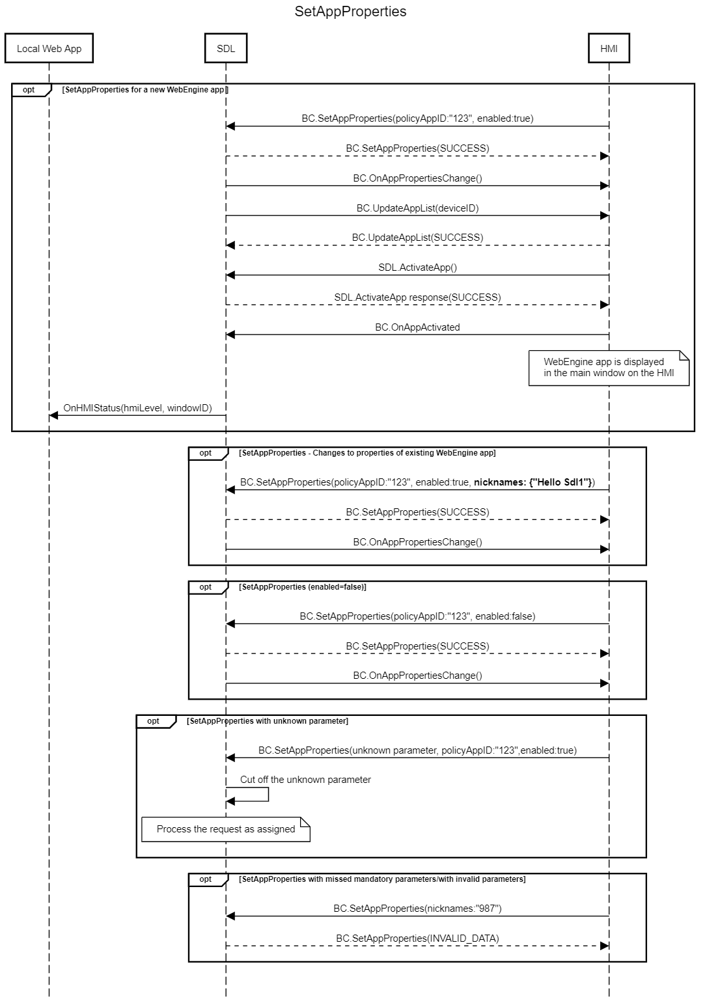

## SetAppProperties

Type
: Function

Sender
: HMI

Purpose
: Enable/disable an application and set authentication data

!!! must

1. Send `SetAppProperties` (enabled=true) to install a web engine app.

!!!

!!! may
* Send an [UpdateSDL](../../sdl/updatesdl) RPC after setting app properties to force SDL to perform a PTU.
* Send `SetAppProperties` (enabled=false) to add web engine apps to SDL that won't be installed on the HMI

!!!

!!! info

* The OEM store uses app data in SDL Server (synchronized from SHAID) for SetAppProperties.
* If SDL does not know the `appID` it should trigger a PTU.

!!!

### Request

#### Parameters

|Name|Type|Mandatory|Additional|
|:---|:---|:--------|:---------|
|properties|[Common.AppProperties](../../common/structs/#appproperties)|true||

### Response

#### Parameters

This RPC has no additional parameter requirements

### Sequence Diagrams

|||
SetAppProperties

|||

### JSON Message Examples

#### Example Request

```json
{
  "id":47,
  "jsonrpc": "2.0",
  "method" : "BasicCommunication.SetAppProperties",
  "params" : {
    "properties": 
        {
          "nicknames": [
            "Hello Sdl"
          ],
          "policyAppID": "123456",
          "enabled": true,
          "transportType": "WS",
          "hybridAppPreference": "CLOUD"
        }
  }
}
```

#### Example Response

```json
{
  "id" : 47,
  "jsonrpc" : "2.0",
  "result" : {
    "code" : 0,
    "method" : "BasicCommunication.SetAppProperties"
  }
}
```

#### Example Error

```json
{
  "id": 47,
  "jsonrpc": "2.0",
  "error": {
    "code": 11,
    "message": "Invalid data",
    "data": {
      "method": "BasicCommunication.SetAppProperties"
    }
  }
}
```