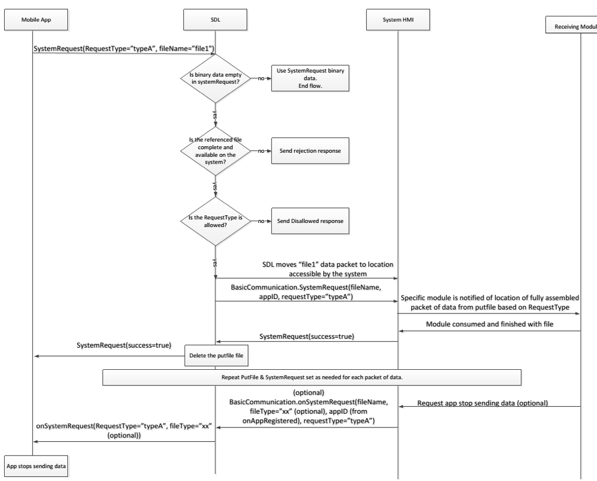

## SystemRequest

  * Type: Function
  * Sender: SDL
  * Provide the path to a system file that SDL has received from the mobile application

SDL sends SystemRequest to the HMI when SDL receives the SystemRequest RPC from a mobile application.

### Behavior

!!! must

Notify any relevant modules about the location of the file which was transferred.

!!!

!!! important

If the HMI does not respond to SDL's request within a specified timeout period (default of 10 seconds), SDL will return GENERIC_ERROR to the corresponding mobile apps request.

!!!

!!! note

SDL validates all SystemRequests sent from the mobile app and returns DISALLOWED if the app's system request contains a RequestType that is not allowed via Policies.  SDL sends the list of RequestTypes allowed by Policies via OnAppPermissionChanged, UpdateAppList, or OnSystemRequest RPCs. If the HMI sends OnSystemRequest with a RequestType which is disallowed by the current policy table, SDL will ignore the notification.

!!!

### Request

#### Parameters

|Name|Type|Mandatory|Additional|
|:---|:---|:--------|:---------|
|requestType|[Common.RequestType](../../Common/Enums/index.md#requesttype)|true||
|fileName|String|true|minlength: 1<br>maxlength: 255|
|appID|String|false|minlength: 1<br>maxlength: 50|

### Response

#### Parameters

This RPC has no additional parameter requirements

### Example Request
``` json
{
	"id" : 59,
	"jsonrpc" : "2.0",
	"method" : "BasicCommunication.SystemRequest"
	"params" :
	{
		"requestType" : "FILE_RESUME",
		"fileName" : "/tmp/fs/mp/images/ivsu_cache/123.json",
		"appID" : 223
	}
}
```

### Example Response
```json
{
	"id" : 59,
	"jsonrpc" : "2.0",
	"result" :
	{
		"code" : 0,
		"method" : "BasicCommunication.SystemRequest"
	}
}
```

### Example Error
```json
{
	"id" : 59,
	"jsonrpc" : "2.0",
	"error" :
	{
		"code" : 11,
		"message" : "Invalid data",
		"data" :
		{
			"method" : "BasicCommunication.SystemRequest"
		}
	}
}
```

### Sequence Diagrams
|||
System Request Workflow

|||
