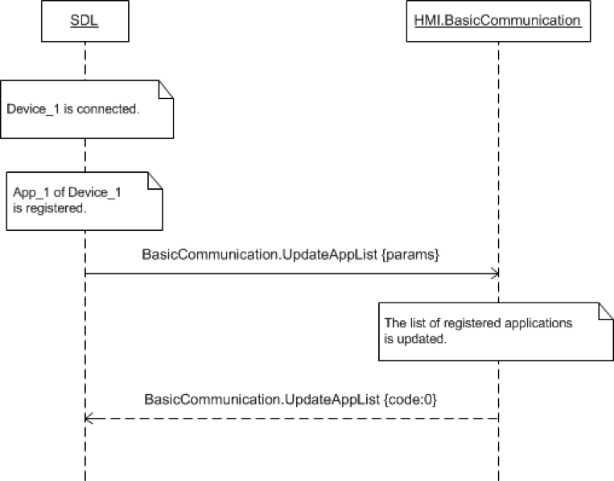
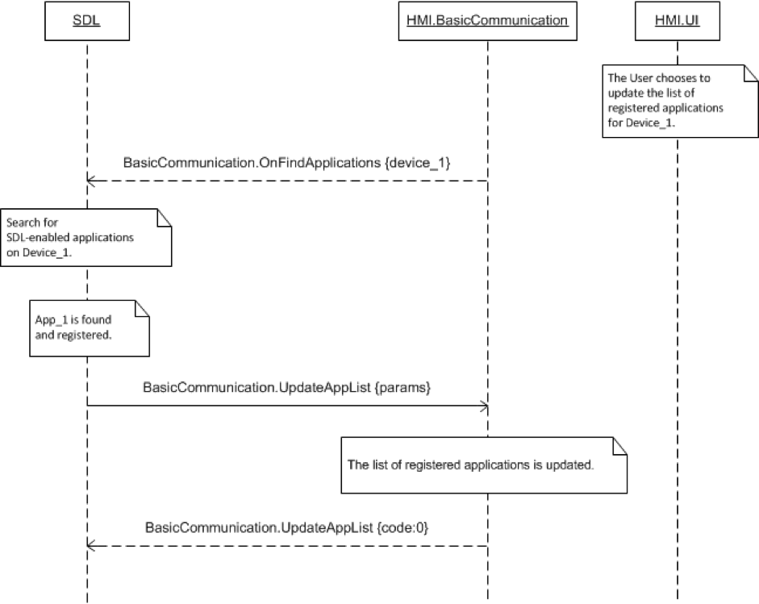

## UpdateAppList

### Request

#### Parameters

|Name|Type|Mandatory|Additional|Description|
|:---|:---|:--------|:---------|:----------|
|applications|Common.HMIApplication|true|array: true minsize: 0 maxsize: 100||

#### HMIApplication

|Name|Type|Mandatory|Additional|Description|
|:---|:---|:--------|:---------|:----------|
|appName|String|true|maxlength: 100||
|ngnMediaScreenAppName|String|false|maxlength: 100||
|icon|String|false|||
|deviceInfo|Common.DeviceInfo|true|||
|policyAppID|String|true|minlength: 1 maxlength: 50||
|ttsName|Common.TTSChunk|false|array: true minsize: 1 maxsize: 100||
|vrSynonyms|String|false|array: true minsize: 1 maxsize: 100 maxlength: 40||
|appID|Integer|true|||
|hmiDisplayLanguageDesired|Common.Language|false|||
|isMediaApplication|Boolean|false|||
|appType|Common.AppHMIType|false|array: true minsize: 1 maxsize: 100||
|greyOut|Boolean|false|||
|requestType|Common.RequestType|false|array: true minsize: 0 maxsize: 100||

### Response

#### Parameters

This RPC has no additional parameter requirements

### Sequence Diagrams
|||
Application Just Registered

|||
|||
User Requests Update App List

|||
