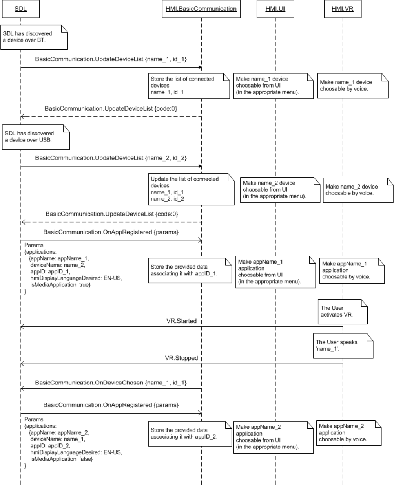
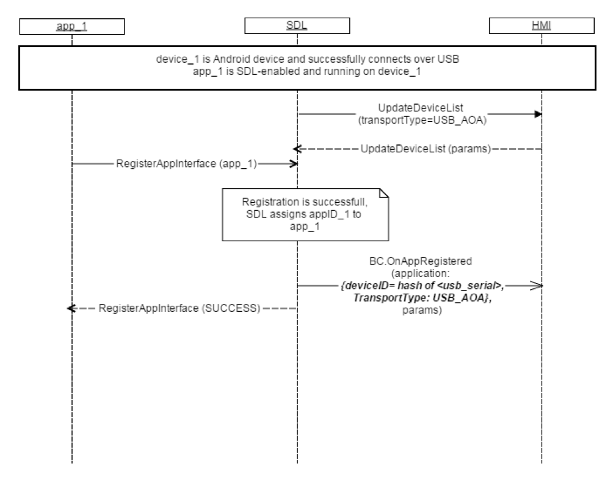

## UpdateDeviceList

###### [TODO: looking for feedback on how to do format this section]

  * Method: BasicCommunication.UpdateDeviceList
  * Sender: SDL
  * Purpose: Update HMI's list of known, connected devices

The `UpdateAppList` request is sent after SDL has found a new device over one of the available transports.

!!! note

The SDL's default Transport Manager (TM) and Transport Adapters (TA) behave in the following way.

  1. Bluetooth Transport
    * TM performs a periodic search over Bluetooth.
    * Once the device is found, SDL starts the procedure of searching for SDL Enabled Applications on the device.
    * SDL Sends `BasicCommunication.UpdateDeviceList` with the name and id of the discovered device to the HMI.
    * SDL needs to receive `OnDeviceChosen(deviceInfo)` or `OnFindApplications(deviceInfo)` from the HMI to allow registering applications which are running on the connected device.
    * SDL allows registration of applications on the named device and sends `BasicCommunication.OnAppRegistered` to the HMI
  2. USB Transport (AOA)
    * SDL learns about a new device connected over USB (A notification to the TA from the OS)
    * SDL Sends `BasicCommunication.UpdateDeviceList` with the name, id, and TransportType (AOA, iOS) of the discovered device to the HMI.
    * SDL sends `BasicCommunication.OnAppRegistered` to the HMI and does not wait for `OnDeviceChosen` or `OnFindApplications` notifications
  3. Wifi Transport
    * SDL learns about a new device connected over Wifi
    * SDL sends `BasicCommunication.UpdateDeviceList` with the name and id of the discovered device to the HMI
    * SDL sends `BasicCommunication.OnAppRegistered` to the HMI and does not wait for `OnDeviceChosen` or `OnFindApplications` notifications

!!!

### Behavior

!!! must

  1. Update list of connected devices (i.e. store the provided information)
  2. Use the information when providing `OnDeviceChosen` and `OnFindApplications` notifications
  3. Provide the user with the possibility of choosing among the found devices through either display, voice recognition or both.

!!!

### Request

#### Parameters

| Param Name | Type    | Mandatory | Additional| Description|
| :------------- | :------------- | :- | :- | :- |
| deviceList     | Common.DeviceInfo      | true | Array = true <br> minsize = 0 <br> maxsize = 100 | The list of devices (name and ID) found. If the array is empty it means that all devices have been disconnected or that no devices are connected yet.|

##### DeviceInfo

| Param Name | Type     | Mandatory | Additional | Description|
| :------------- | :------------- | :- | :- | :- |
| name      | String      | true | | The name of the connected device |
| id | String | true | | The id of the connected device. Either hash of device's USB serial number or mac address. Remains unique between ignition cycles for connections of the same device on a single transport.|
| transportType| Common.TransportType| false| | The transport type which the device is connected over. Always returned by SDL in OnAppRegistered and UpdateAppList RPCs|
| isSDLAllowed| Boolean | false | | Sent by SDL in UpdateDeviceList. True if the device is allowed for the PolicyTable exchange, false if the device is not allowed for Policy Table exchange|

##### TransportType

| Name | Value    |
| :------------- | :------------- |
| BLUETOOTH     | 0      |
| USB_IOS | 1|
| USB_AOA | 2|
| WIFI | 3|

### Response

This RPC response has no additional parameter requirements

### Example Request

```json
{
	"id" : 64,
	"jsonrpc" : "2.0",
	"method" : "BasicCommunication.UpdateDeviceList",
	"params" :
	{
		"deviceList" :
		[			
			{
				"name" : "Jerry`s Phone",
				"id" : 3
			},

			{
				"name" : "XT910",
				"id" : 4
			}
		]
	}
}
```

### Example Response

```json
{
	"id" : 64,
	"jsonrpc" : "2.0",
	"result" : {
		"code" : 0,
		"method" : "BasicCommunication.UpdateDeviceList"
	}
}
```

### Example Error

```json
{
	"id" : 64,
	"jsonrpc" : "2.0",
	"error" : {
		"code" : 11,
		"message" : " The data sent is invalid.",
		"data" : {
			"method" : "BasicCommunication.UpdateDeviceList"
		}
	}
}
```

### Sequence Diagrams

##### UpdateDeviceList after SDL discovers device over BT or USB



##### UpdateDeviceList iOS


##### UpdateDeviceList USB AOA


