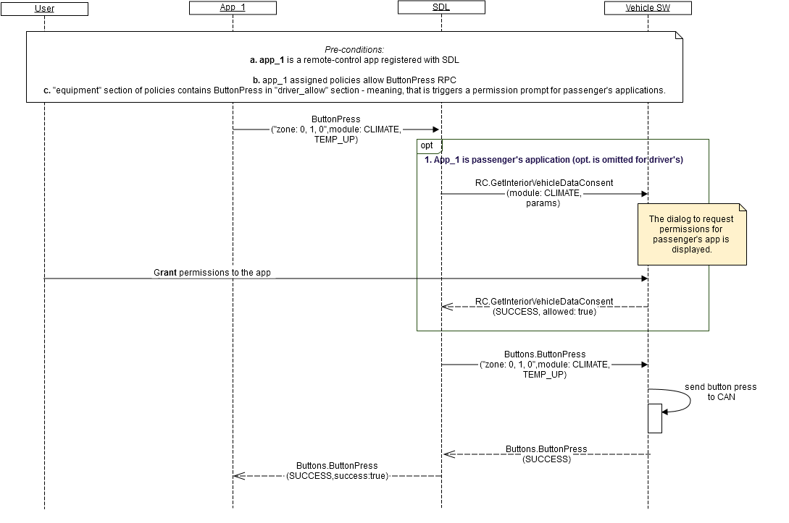

## ButtonPress
Type
:	Function

Sender
:	SDL

Purpose
:	Press a button remotely

_**Trigger to send:**_   
RSDL sends Buttons.ButtonPress to the vehicle:after receiving a valid ButtonPress request from a remote-control application.
 
_**Error handling:**_   

1.	RSDL validates response from the vehicle and in case it's invalid, RSDL returns GENERIC_ERROR result to the corresponding mobile application's request.
Validation includes:   
      - JSON format to be valid.   
 
2. RSDL waits for response from the vehicle during RSDL's internal timeout for vehicle RPCs ("DefaultTimeout" parameter in SmartDeviceLink.ini file; set to 10 sec by default) and in case it's not received, RSDL returns GENERIC_ERROR result to the corresponding mobile application's request.   
 
3. RSDL transfers only button names that match the specified module to the vehicle (for example, the button REPEAT will be sent with module RADIO only):   
      - Radio buttons: VOLUME_UP, VOLUME_DOWN, EJECT, SOURCE, SHUFFLE, REPEAT;   
      - Climate buttons: AC_MAX, AC, RECIRCULATE, FAN_UP, FAN_DOWN, TEMP_UP, TEMP_DOWN, DEFROST_MAX, DEFROST, DEFROST_REAR, UPPER_VENT, LOWER_VENT.   

### Request

_**Behavior**_:   

1.	_Happy path_ (see diagram A) - the vehicle must:   
 1.1. Process the request in the following way:   
     a.Send the signal to CAN about the named button is pressed with the named press mode.   
2. Module is busy - the vehicle must:   
 2.1. Respond with REJECTED resultCode in case the request is from passenger's application and another passenger's application is currently controlling the same module (no matter in what location).   
        _Information:_ The vehicle is expected to allow only one passenger's application and one driver's application to control the same module at the same time.  
3. Other result codes - the vehicle may:    
 3.1. Implement additional checks and return the resultCodes described in "applicable result codes" table of Response.
 
#### Parameters
 
|    Param Name         |    Type                      |    Mandatory    |    Description                                                           |
|-----------------------|------------------------------|-----------------|--------------------------------------------------------------------------|
|    zone               |    Common.InteriorZone       |    true         |    The zone where the button press should   occur.                       |
|    moduleType         |    Common.ModuleType         |    true         |    Defines the module where the button   should be pressed.              |
|    buttonName         |    Common.ButtonName         |    true         |    Name of the button.                                                   |
|    buttonPressMode    |    Common.ButtonPressMode    |    true         |    Indicates   whether this is a LONG or SHORT press event.              |
|    appID              |    Integer                   |    true         |    Internal SDL-assigned Id of the   application related to this RPC.    |
 
 
### Response

_**Behavior**_:   
The below table lists resultCodes that the vehicle may use to respond: 

|Result|Description|Message type-WebSocket|Message type - D-Bus|Message Params|Notes|
|:------|:---------|:---------------------|:-------------------|:-------------|:----|
|Success|SUCCESS The vehicle successfully processes the request:<br> The requested button press was sent to the CAN bus.|JSON response|Regular response|moduleData,isSubscribed, code: 0|See example "response".|
|Failure|UNSUPPORTED_RESOURCE The vehicle does not support the requested button.|JSON error message|Regular response|code: 2|Applicable for this RPC result codes. Please see Result Enumeration for all SDL-supported codes. See example "error message".|
|Failure|REJECTED The vehicle rejects GetInteriorVehicleData request because of<br>Other tasks of higher priority<br>The requested module is busy with another passenger's application.|JSON error message|Regular response|code: 4|Applicable for this RPC result codes. Please see Result Enumeration for all SDL-supported codes. See example "error message".|
|Failure|IGNORED The vehicle ignores the repeated request.|JSON error message|Regular response|code: 6|Applicable for this RPC result codes. Please see Result Enumeration for all SDL-supported codes. See example "error message".|
|Failure|GENERIC_ERROR The unknown issue occurred or other codes are not applicable.|JSON error message|Regular response|code: 22|Applicable for this RPC result codes. Please see Result Enumeration for all SDL-supported codes. See example "error message".|

### Sequence Diagrams   

A. RSDL transfers vehcile's successful response to the mobile application 


 
### Example Request 

```json
 "id" : 89,
     "jsonrpc" : "2.0",
     "method" : "Buttons.ButtonPress",
     “params” :
     {             
      "zone" :
      {
                  "col" : 0,
                  "row" : 1,
                  "level" : 0,
                  "colspan" : 2,
                  "rowspan" : 2,
                  "levelspan" : 0   
      },
      "moduleType" : "CLIMATE",
      "buttonName" : "TEMP_DOWN",
      "buttonPressMode" : "SHORT",
      "appID" : 65128
     }
}
```

### Example Response

```json
 {
     "id" : 89,
     "jsonrpc" : "2.0",
     "result" :
     {
      "code" : 0,
      "method" : "Buttons.ButtonPress"
     }
}
```

### Example Error
```json
{
     "id" : 89,
     "jsonrpc" : "2.0",
     "error" :
     {
      "code" : 4,
      "message" : "The request is rejected because the module is busy",
      "data" :
      {
                 "method" : "Buttons.ButtonPress"
      }
     }
}
```
