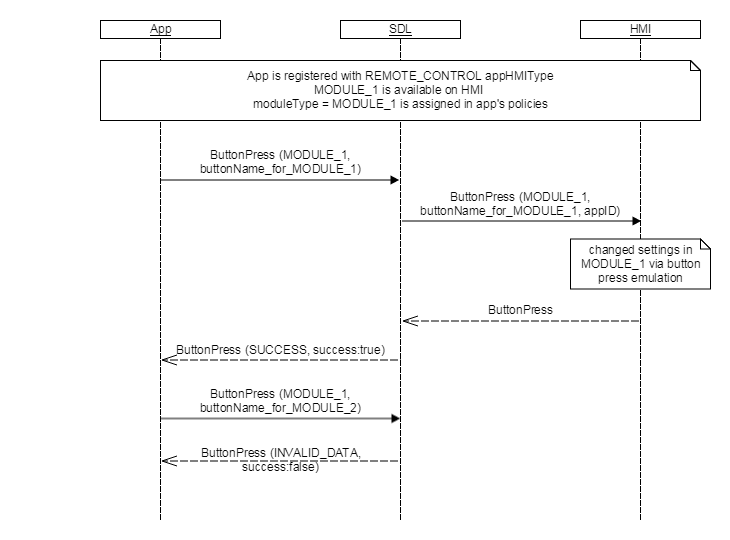

## ButtonPress

Type
: Function

Sender
: SDL

Purpose
: Emulate button press event on HMI for the common climate or radio control buttons in vehicle

ButtonPress represents a request from an application to change settings of requested RC module by pressing the appropriate button.
This RPC can be sent to the HMI from an application that is registered with REMOTE_CONTROL appHMIType and in one of the following states: FULL, LIMITTED, BACKGROUND.
Module signed by the application in such request has to be available on HMI and allowed for control change settings.
The system shall list all available RC radio buttons and RC climate buttons in the existing ButtonCapabilities list.

!!! must

  1. Modules sent by application must be available on HMI
  2. Access to control module settings is defined by access mode entered by user on HMI
  3. Requested control buttons have to be available for such module on HMI


!!!

### Request

#### Parameters

|Name|Type|Mandatory|Additional|Description|
|:---|:----------|:---|:---------|:---------|
|moduleType|[Common.ModuleType](../../common/enums/#moduletype)|true| |The module where the button should be pressed|
|moduleId|String|false|maxlength: 100|Id of a module, published by System Capability.|
|buttonName|[Common.ButtonName](../../common/enums/#buttonname)|true| | |
|buttonPressMode|[Common.ButtonPressMode](../../common/enums/#buttonpressmode)|true| |Indicates whether this is a LONG or SHORT button press event.|
|appID|Integer|true| |Internal SDL-assigned ID of the related application|

### Response

#### Parameters

This RPC has no additional parameter requirements

### Sequence Diagrams

|||
ButtonPress

|||

### JSON Message Examples

#### Example Request

```json
{
    "id": 32,
    "jsonrpc": "2.0",
    "method": "Buttons.ButtonPress",
    "params": {
        "appID": 680015438,
        "buttonName": "VOLUME_UP",
        "buttonPressMode": "LONG",
        "moduleId" : "12jie32ice496hnr68swe",
        "moduleType": "RADIO"
    }
}
```

#### Example Response

```json
{
    "id": 32,
    "jsonrpc": "2.0",
    "result": {
        "code": 0,
        "method": "Buttons.ButtonPress"
    }
}
```

#### Example Error

```json
{
  "id" : 32,
  "jsonrpc" : "2.0",
  "error" :
  {
    "code" : 22,
    "message" : "An unknown issue occurred ",
    "data" :
    {
      "method" : "Buttons.ButtonPress"
    }
  }
}
```
