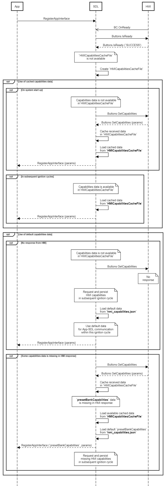

## GetCapabilities


### Request

#### Parameters

|Name|Type|Mandatory|Additional|Description|
|:---|:---|:--------|:---------|:----------|

### Response

#### Parameters

|Name|Type|Mandatory|Additional|Description|
|:---|:---|:--------|:---------|:----------|
|capabilities|Common.ButtonCapabilities|true|array: true<br>minsize: 1<br>maxsize: 100||
|presetBankCapabilities|Common.PresetBankCapabilities|false|||

#### ButtonCapabilities

|Name|Type|Mandatory|Additional|Description|
|:---|:---|:--------|:---------|:----------|
|name|Common.ButtonName|true|||
|shortPressAvailable|Boolean|true|||
|longPressAvailable|Boolean|true|||
|upDownAvailable|Boolean|true|||

#### PresetBankCapabilities

|Name|Type|Mandatory|Additional|Description|
|:---|:---|:--------|:---------|:----------|
|onScreenPresetsAvailable|Boolean|true|||

### Sequence Diagrams
|||
GetCapabilities on system startup

|||

### Example Request

```json
{
	"id" : 20,
	"jsonrpc" : "2.0",
	"method" : "Buttons.GetCapabilities"
}
```
### Example Response

```json
{
	"id" : 20,
	"jsonrpc" : "2.0",
	"result" :
	{
		"capabilities" :
		[
			{
				"name" : OK,
				"shortPressAvailable" : true,
				"longPressAvailable" : true,
				"upDownAvailable" : true
			},
			{
				"name" : SEEKLEFT,
				"shortPressAvailable" : true,
				"longPressAvailable" : true,
				"upDownAvailable" : true
			},
			{
				"name" : SEEKRIGHT,
				"shortPressAvailable" : true,
				"longPressAvailable" : true,
				"upDownAvailable" : true
			},
			{
				"name" : TUNEUP,
				"shortPressAvailable" : true,
				"longPressAvailable" : true,
				"upDownAvailable" : true
			},
			{
				"name" : TUNEDOWN,
				"shortPressAvailable" : true,
				"longPressAvailable" : true,
				"upDownAvailable" : true
			},
		],
		"presetBankCapabilities" :
		[
			"onScreenPresetsAvailable" : true
		],
		"code" : 0,
		"method" : "Buttons.GetCapabilities"
	}
}
```

### Example Error

```json
{
	"id" : 20,
	"jsonrpc" : "2.0",
	"error" :
	{
		"code" : 9,
		"message" : "The requested data is not available",
		"data" :
		{
			"method" : "Buttons.GetCapabilities"
		}
	}
}
```
