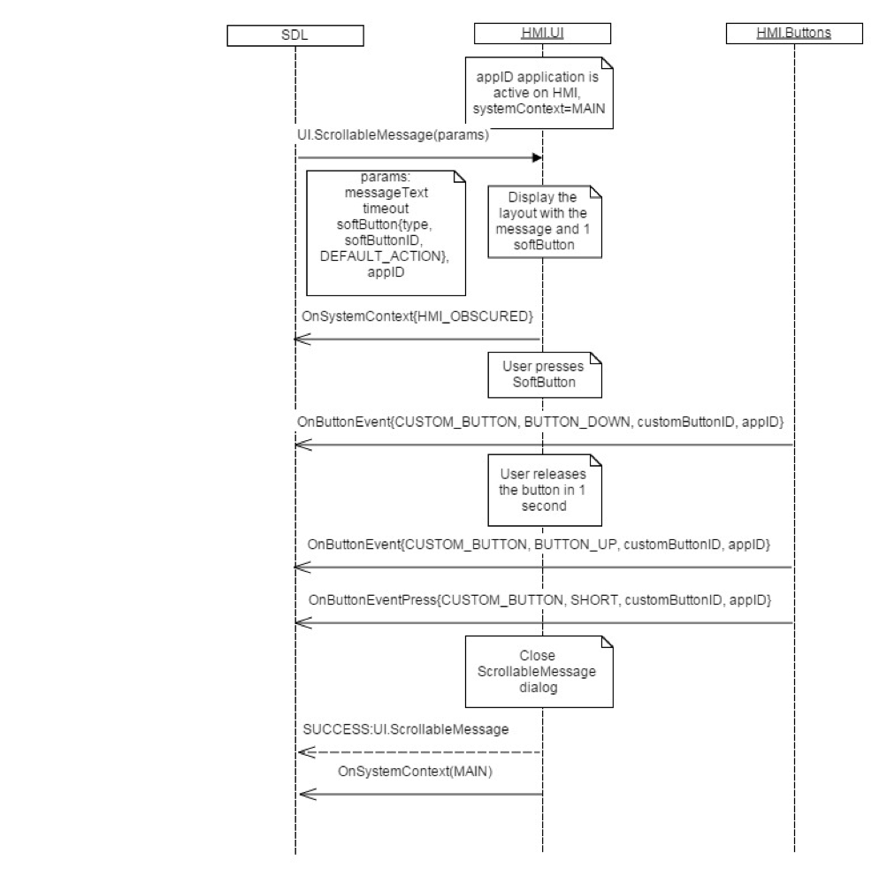
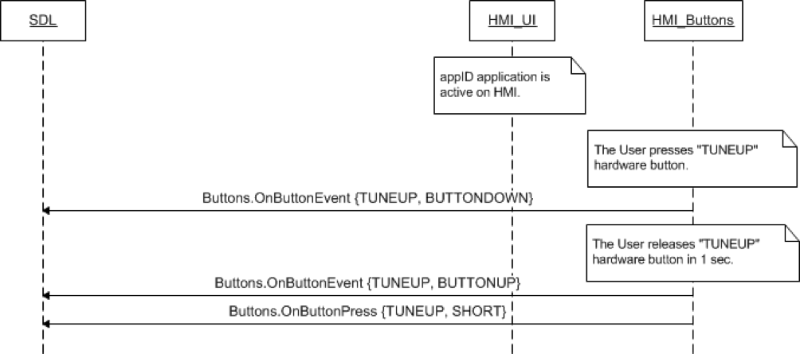

## OnButtonEvent


### Notification

#### Parameters

|Name|Type|Mandatory|Additional|Description|
|:---|:---|:--------|:---------|:----------|
|name|Common.ButtonName|true|||
|mode|Common.ButtonEventMode|true|||
|customButtonID|Integer|false|minvalue: 0<br>maxvalue: 65536||
|appID|Integer|false|||

#### ButtonName

|Name|Value|
|:---|:----|
|OK|0|
|SEEKLEFT|1|
|SEEKRIGHT|2|
|TUNEUP|3|
|TUNEDOWN|4|
|PRESET_0|5|
|PRESET_1|6|
|PRESET_2|7|
|PRESET_3|8|
|PRESET_4|9|
|PRESET_5|10|
|PRESET_6|11|
|PRESET_7|12|
|PRESET_8|13|
|PRESET_9|14|
|CUSTOM_BUTTON|15|
|SEARCH|16|

#### ButtonEventMode

|Name|Value|
|:---|:----|
|BUTTONUP|0|
|BUTTONDOWN|1|

### Sequence Diagrams
|||
OnButtonEvent for CUSTOM_BUTTON pressed and released

|||
|||
OnButtonEvent hardware button pressed and released

|||

#### JSON Example Notification
```json

```
