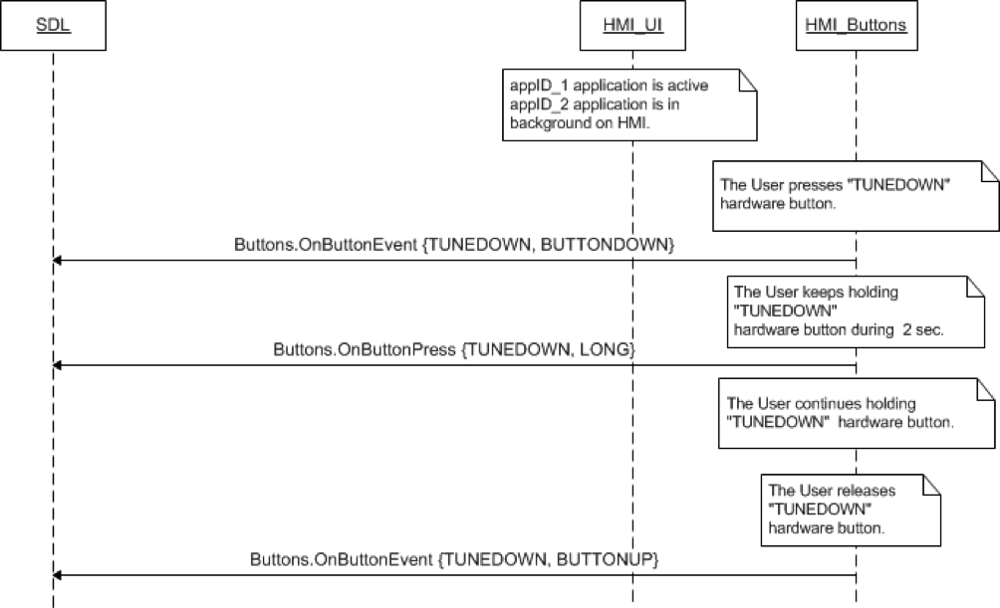
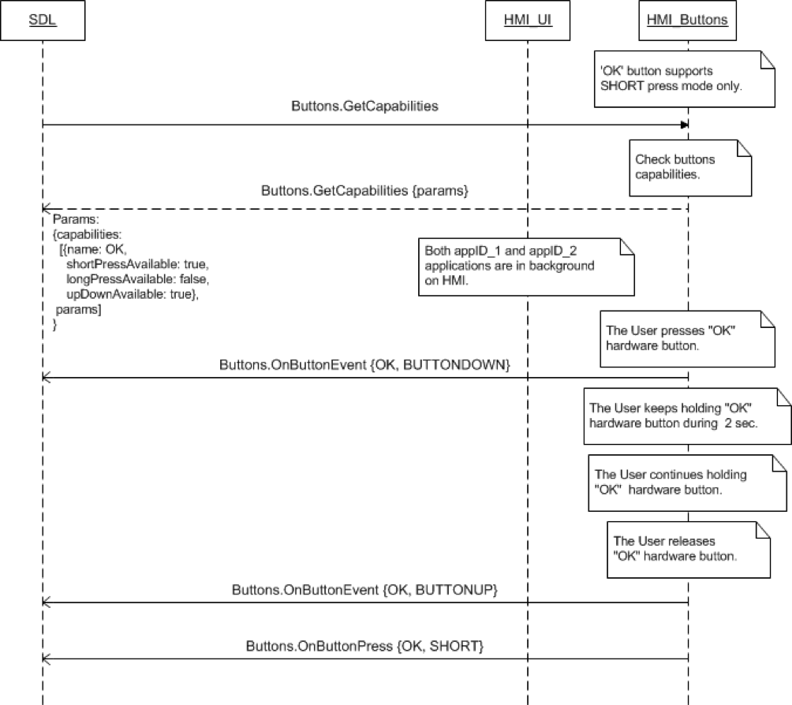

## OnButtonPress

Type
: Notification

Sender
: HMI

Purpose
: Inform SDL about a Button Press

If the HMI reports to SDL via [Buttons.GetCapabilities](../getcapabilities) that it supports long and/or short button press modes, SDL expects the HMI to send the Buttons.OnButtonPress notification but buttons that have been subscribed via [Buttons.OnButtonSubscription](../onbuttonsubscription) and custom buttons added in other rpcs as Soft Buttons.

!!! must

The hmi must send the name of the button pressed, the press mode detected, and ID of the button if it has type `CUSTOM_BUTTON` and the appID related to the button press. If only `SHORT` button press mode is supported, the hmi should send `SHORT` regardless of the time of the button press.

!!!

!!! note

The value of customButtonID is provided by SDL within the [softButton](../../common/structs/#softbutton) struct for some rpcs such as [UI.Alert](../../ui/alert)

!!!

### Notification

#### Parameters

|Name|Type|Mandatory|Additional|
|:---|:---|:--------|:---------|
|name|[Common.ButtonName](../../common/enums/#buttonname)|true||
|mode|[Common.ButtonPressMode](../../common/enums/#buttonpressmode)|true||
|customButtonID|Integer|false|minvalue: 0<br>maxvalue: 65536|
|appID|Integer|false||

### Sequence Diagrams
|||
OnButtonPress short press for CUSTOM_BUTTON

|||
|||
OnButtonPress long press for hard button

|||
|||
OnButtonPress for hard button that only supports short press

|||

#### JSON Example Notification
```json
{
  "jsonrpc" : "2.0",
  "method" : "Buttons.OnButtonPress",
  "params" :
  {
    "name" : "CUSTOM_BUTTON",
    "mode" : "SHORT",
    "customButtonID" : 564
  }
}
```
