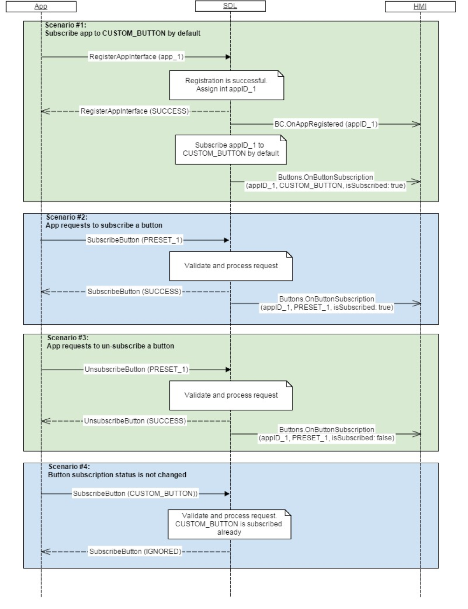

## OnButtonSubscription


### Notification

#### Parameters

|Name|Type|Mandatory|Additional|Description|
|:---|:---|:--------|:---------|:----------|
|name|Common.ButtonName|true|||
|isSubscribed|Boolean|true|||
|appID|Integer|true|||

#### ButtonName

|Name|Value|
|:---|:----|
|OK|0|
|SEEKLEFT|1|
|SEEKRIGHT|2|
|TUNEUP|3|
|TUNEDOWN|4|
|PRESET_0|5|
|PRESET_1|6|
|PRESET_2|7|
|PRESET_3|8|
|PRESET_4|9|
|PRESET_5|10|
|PRESET_6|11|
|PRESET_7|12|
|PRESET_8|13|
|PRESET_9|14|
|CUSTOM_BUTTON|15|
|SEARCH|16|

### Sequence Diagrams
|||
OnButtonSubscription

|||

#### JSON Example Notification
```json
{
	"jsonrpc" : "2.0",
	"method" : "Buttons.OnButtonSubscription",
	"params" :
	{
		"name" : "SEEKLEFT",
		"isSubscribed" : true,
		"appID" : 564
	}
}
```
