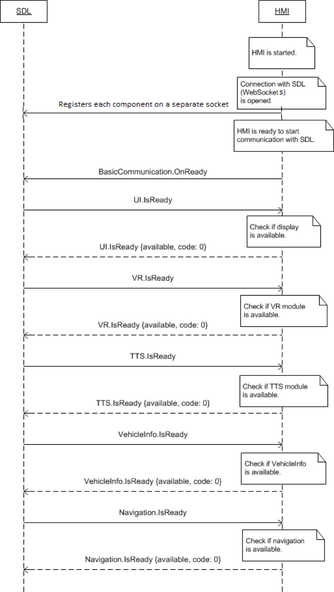

# Getting Started

## Component Readiness Confirmation

The HMI must register each component which can communicate with SDL using the following RPC format

```json
{
  "jsonrpc": "2.0",
  "id": -1,
  "method": "MB.registerComponent",
  "params": {
    "componentName": componentName
  }
}
```

The possible componentNames are:  
  * `UI`
  * `Buttons`
  * `BasicCommunication`
  * `VR` 
  * `TTS`
  * `Navigation`
  * `VehicleInfo`
  * `RC`
  * `AppService`

Once the components are registered, the HMI must notify sdl that it is ready to begin further communication using the [BasicCommunication.OnReady](../basiccommunication/onready) notification.

Upon receipt of the OnReady notification, SDL will begin checking the availablility of the different HMI components via a chain of requests:

  * `UI.IsReady` - The display availability
  * `VR.IsReady` - The voice recognition module availability
  * `TTS.IsReady` - The Text-To-Speech module availability
  * `Navigation.IsReady` - Navigation engine availability
  * `VehicleInfo.IsReady` - Indicates whether vehicle information can be collected and provided
  * `RC.IsReady` - Indicates whether vehicle RC modules are present and ready to communicate with SDL
 
## Registering for Notifications
The HMI must also register for notifications individually using the following RPC format

```json
{
  "jsonrpc": "2.0",
  "id": -1,
  "method": "MB.subscribeTo",
  "params": {
    "propertyName": notificationName
  }
}
```

Where propertyName is the name of the notification, such as `Buttons.OnButtonSubscription`

!!! must

The HMI must:
  * Register its components
  * Send the OnReady notification
  * Respond to each of the `IsReady` RPCs
  * Register for the notifications it would like to receive

!!!

!!! info

If the response to any of the component `IsReady` requests contains `{"available": false}`, SDL will no longer communicate with that component.

!!!


### IsReady Sequence Diagram

!!! note

In the case of a WebSocket connection, the RPCs to each of the components is sent within each separate WebSocket connection.

!!!

|||
IsReady Sequence

|||
