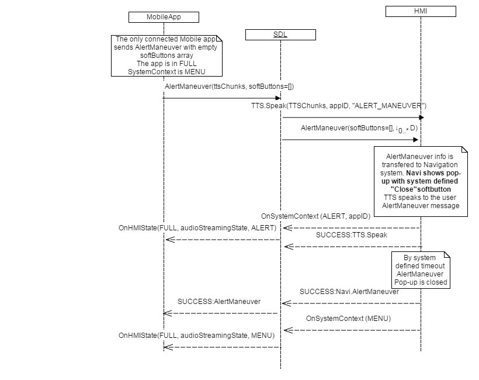
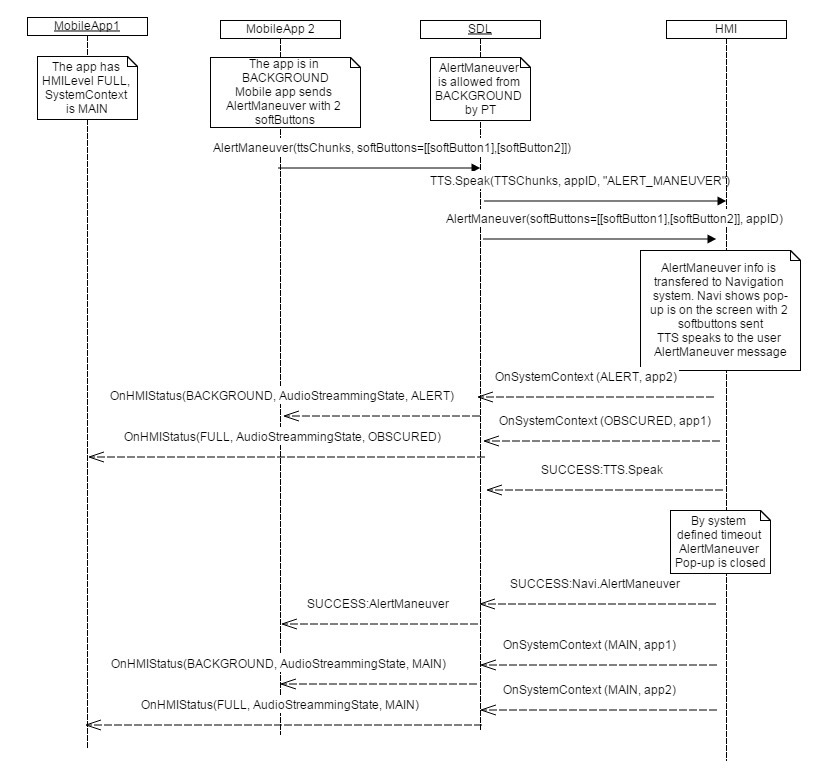
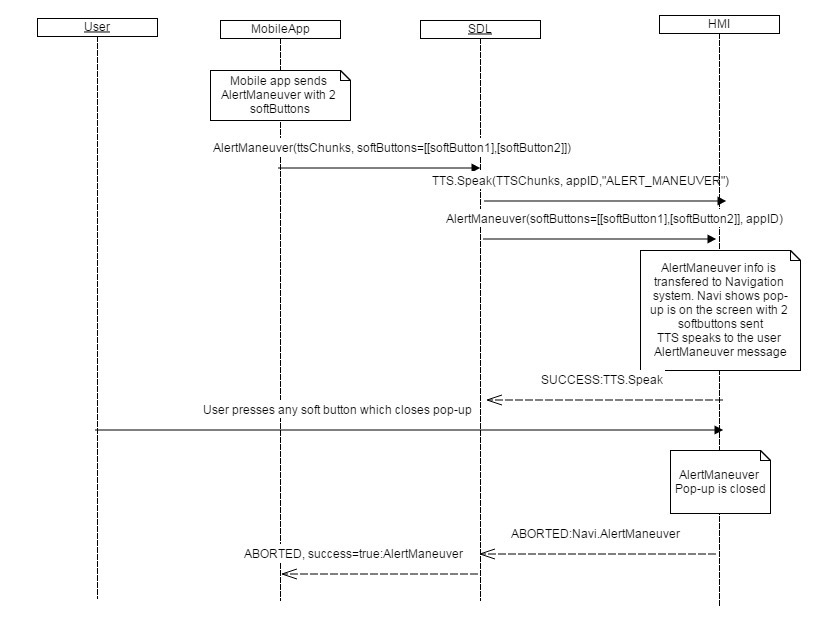
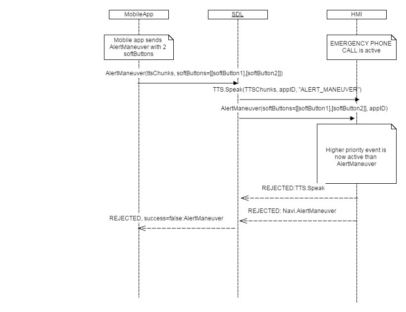

## AlertManeuver

Type
: Function

Sender
: SDL

Purpose
: Announce a navigation maneuver.

SDL sends `AlertManeuver` together with [TTS.Speak](../../tts/speak). The purpose of this RPC is to notify the embedded navigation system about the next navigation maneuver.

!!! MAY

  1. Notify the user by [TTS.Speak](../../tts/speak), which is sent along with `AlertManeuver`.
  2. Display the `AlertManeuver` dialog with an alert icon and one of the following:
    * Up to three soft buttons defined within the `softButtons` paremeter.
    * HMI-defined `Close` soft button if a request without `softButtons` is received.
  3. Process `SystemContext` behavior for `AlertManeuver` in the same way an `Alert` is handled.

!!!

!!! MUST

[UI.OnSystemContext](../../ui/onsystemcontext) `appID` rules if `AlertManeuver` causes `SystemContext` updates:

  1. `appID` should not be sent for `MENU` and `HMI_OBSCURED` system contexts. Only apps in `FULL` should receive these updates.
  2. If the HMI sends `appID` with [UI.OnSystemContext](../../ui/onsystemcontext)(`MENU` or `HMI_OBSCURED`), `appID` is ignored and the notification is transferred to the application that is in `FULL`.
  3. [UI.OnSystemContext](../../ui/onsystemcontext)'s `appID` parameter should be mandatory for `MAIN` and `ALERT` values. If no `appID` is sent for this case, the notification will be ignored by SDL.


!!!

!!! NOTE

If the HMI does not respond to SDL's request, after the default timeout occurs SDL will send `GENERIC_ERROR` to the corresponding mobile application.

!!!
### Request

#### Parameters

|Name|Type|Mandatory|Additional|
|:---|:---|:--------|:---------|
|softButtons|[Common.SoftButton](../../common/structs/#softbutton)|false|array: true<br>minsize: 0<br>maxsize: 3|
|appID|Integer|true||

### Response

#### Parameters

This RPC has no additional parameter requirements

### Sequence Diagrams
|||
AlertManeuver Default Success Path

|||
|||
AlertManeuver from Background

|||
|||
AlertManeuver Aborted

|||
|||
AlertManeuver Rejected

|||

### JSON Example Request

```json
{
  "id": 143,
  "jsonrpc": "2.0",
  "method": "Navigation.AlertManeuver",
  "params": {
    "softButtons": [
      {
        "type": "TEXT",
        "text": "Leave Onscreen",
        "softButtonID": 45,
        "systemAction": "KEEP_CONTEXT"
      },
      {
        "type": "TEXT",
        "text": "Close",
        "softButtonID": 46,
        "systemAction": "STEAL_FOCUS"
      }
    ]
  },
  "appID": 96
}
```

### JSON Example Response

```json
{
  "id" : 143,
  "jsonrpc" : "2.0",
  "result" :
  {
    "code" : 0,
    "method" : "Navigation.AlertManeuver"
  }
}
```

### JSON Example Error

```json
{
  "id" : 143,
  "jsonrpc" : "2.0",
  "error" :
  {
    "code" : 13,
    "message" : "The command cannot be executed because there is NO app registered with the specified appID",
    "data" :
    {
      "method" : "Navigation.AlertManeuver"
    }
  }
}
```
