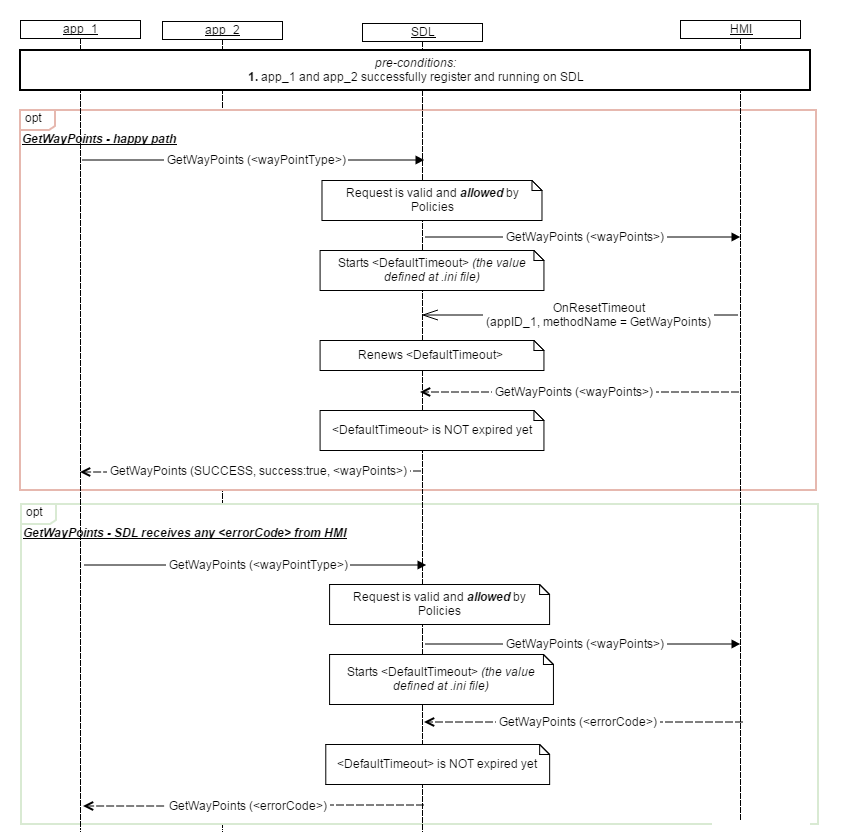

## GetWayPoints

Type
: Notification

Sender
: SDL

Purpose
: Request for getting waypoint/destination data.

SDL requests to get waypoint/destination information data sent from the mobile application to the embedded navigation system.

### Request

**HMI must:**

1. Accept requests for getting details of active destination and waypoints and provide details in response to the request.

2. HMI must send OnResetTimeout to SDL in case HMI needs more time for processing GetWayPoints request.


**SDL Note:** In case HMI does not respond SDL's request during SDL default timeout (10 sec), SDL will return GENERIC_ERROR code to the corresponding mobile app's request


#### Parameters

|Param Name|Type|Mandatory|Additional|Description
|:--------|:-------|:--------|:---------|:------------------------
|wayPointType|wayPointType|true|defvalue="ALL"|To request for either the destination only or for all waypoints including destination
|appID|Integer|true|-|ID of the application that concerns this RPC

#### WaypointType Enumeration

|Element Name|Short Description|
|:-----------|:--------------------|
|ALL|All waypoints including destination|
|DESTINATION|Only destination|


### Response
**HMI must:**


1. wait for 'Number of Waypoints' x 5ms + 10 ms for the navigation system to respond with the full data. (Wait for data and reset timer with OnResetTimeout notification), upon receipt of 'Number of Wapoints'. The AppLink layer shall keep resetting the SDL timer till the expiry of this time.

2. **In case if multiple requests:** while a request for getting waypoints is being processed, if HMI receives another request from the same app then the system shall reject the new request with a response of IN_USE.
3. **In case there is no active navigation source:** when a request for getting Waypoints and Destination data is received, if there is no active navigation source, the system shall provide a response of UNSUPPORTED_RESOURCE.
4. Provide a response of TIMED_OUT: **a) In case** the system **does not get the full data** from the navigation system **within timeout** period, the system shall, ignore and discard any data received from the navigation system after the timeout period. **b) In case timeout notice:** if the system receives a time out notification from the navigation system

5. If the system receives any kind of failure notification other than time-out from the navigation system, then the system shall provide a response of REJECTED.

6. When the system receives all the data from the navigation system within the timeout period, the system shall send provide a response of SUCCESS and send the data within the response.

7. The array of waypoints shall be ordered according to the order of the route with details of the Destination being the first entry in the array, the first waypoint on the route will be set as the second entry in the array, the second waypoint on the route will be set as the third entry in the array and so on.

8. If there is no active route set then the system send a response of SUCCESS with Number Of Waypoints set to 0.

#### Parameters

|Param Name|Type|Mandatory|Additional|Description
|:--------|:-------|:--------|:---------|:---------
|wayPointS|LocationDetails|false|minsize="1"<br>maxsize="10"|See LocationDetails below


#### LocationDetails Structure


|Param Name|Type|Mandatory|Additional|Description
|:--------|:-------|:--------|:---------|:------------------------
|Coordinate|Common.Coordinate|false|-|Latitude/Longitude of the location|
|locationName|String|false|Maxlength = 500|Name of location|
|addressLines|String|false|maxlength="500"<br>minsize="0"<br>maxsize="4"|Location address for display purposes only|
|locationDescription|String|false|maxlength="500"|Description intended location/establishment (if applicable)
|phoneNumber|String|false|maxlength="500"|Phone number of location/establishment|
|locationImage|Image|false|-|Image/icon of intended location|
|searchAddress|OASISAddress|false|-|Address to be used by navigation engines for search|


#### Coordinate Structure
|Param Name|Type|Mandatory|Additional|Description
|:--------|:-------|:--------|:---------|:------------------------
|latitudeDegrees|Double|true|minvalue="-90"<br>maxvalue="90"|Latitude of the location
|longitudeDegrees|Double|true|minvalue="-180"<br>maxvalue="180"|Longitude of the location


#### OASISdress Structure
|Param Name|Type|Mandatory|Additional|Description
|:-----------------|:-------|:--------|:---------|:------------------------
|countryName|String|false|minlength="0"<br>maxlength="200"|Name of the country (localized)
|countryCode|String|false|minlength="0"<br>maxlength="50|Name of country (ISO 3166-2)
|postalCode|String|false|minlength="0"<br>maxlength="16"|PLZ, ZIP, PIN, CAP etc.
|administrativeArea|String|false|minlength="0"<br>maxlength="200"|Portion of country (e.g. state)
|subAdministrativeArea|String|false|minlength="0"<br>maxlength="200"|Portion of e.g. state (e.g. county)
|Locality|String|false|minlength="0"<br>maxlength="200"|Hypernym for e.g. city/village
|subLocality|String|false|minlength="0"<br>maxlength="200"|Hypernym for e.g. district
|Thoroughfare|String|false|minlength="0"<br>maxlength="200"|Hypernym for street, road etc.
|subThoroughfare|String|false|minlength="0"<br>maxlength="200"|Portion of thoroughfare e.g. house number


### Sequence Diagrams
|||
GetWayPoints

|||

### JSON Messages Examples

### Request

```
{
	"id" : 543,
	"jsonrpc" : "2.0",
	"method" : "Navigation.GetWaypoints",
	"params" :
     {
       "wayPointType" : "ALL",
       "appID" : 26743
}

```

### Response

```
{
	"id" : 543,
	"jsonrpc" : "2.0",
	"method" : "Navigation.GetWaypoints",
	"result" :
	{
		"wayPoints" :
		[
			{
				"phoneNumber" :  navigationText1,
				"addressLines" : "addresstext"
			},
		"appID" : 26743
	}
}

```
### Error message

```
{
	"id" : 543,
	"jsonrpc" : "2.0",
	"error" :
	{
		"code" : 11,
		"message" : "The data sent is invalid",
		"data" :
		{
			"method" : "Navigation.GetWaypoints"
		}
	}
}

```
