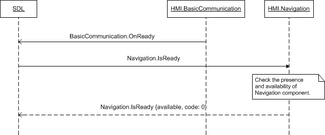

## IsReady

Type
: Function

Sender
: SDL

Purpose
: Request ready state of Navigation Module

This request comes from SDL after the HMI has confirmed its readiness via [OnReady](../../basiccommunication/onready).

!!! NOTE

If the Navigation component responds as `unavailable`, SDL will not send further requests to this component.

!!!

!!! MUST

  1. Check if the Navigation component is present and ready to communicate with SDL.
  2. Respond correspondingly to the results of this check.

!!!

### Request

#### Parameters

This RPC has no additional parameter requirements.

### Response

#### Parameters

|Name|Type|Mandatory|Additional|
|:---|:---|:--------|:---------|
|available|Boolean|true||

### Sequence Diagrams
|||
IsReady

|||

### Example Request

```json
{
  "id" : 27,
  "jsonrpc" : "2.0",
  "method" : "Navigation.IsReady"
}
```
### Example Response

```json
{
  "id" : 27,
  "jsonrpc" : "2.0",
  "result" :
  {
    "availabe" : true,
    "code" : 0,
    "method" : "Navigation.IsReady"
  }
}
```

### Example Error

```json
{
  "id" : 27,
  "jsonrpc" : "2.0",
  "error" :
  {
    "code" : 22,
    "message" : "An unknown error has occurred",
    "data" :
    {
      "method" : "Navigation.IsReady"
    }
  }
}
```
