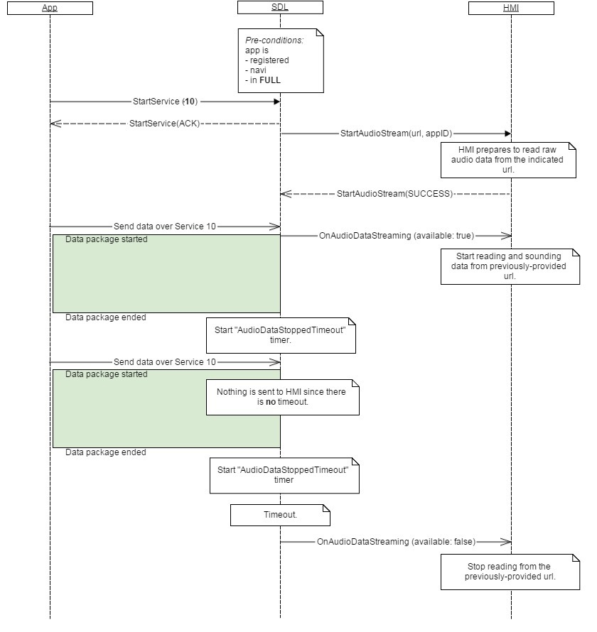

## OnAudioDataStreaming

Type
: Notification

Sender
: SDL

Purpose
: Notify the HMI about a raw audio data stream which should be audible to the user.

### Notification

#### Parameters

|Name|Type|Mandatory|Additional|
|:---|:---|:--------|:---------|
|available|Boolean|true||


### Sequence Diagrams
|||
OnAudioDataStreaming SDL to HMI

|||
|||
OnAudioDataStreaming App to HMI

|||

### JSON Message Examples

#### Example Notification
```json
{
  "jsonrpc" : "2.0",
  "method" : "Navigation.OnAudioDataStreaming",
  "params" :  
  {
    "available" : true
  }
}
```
