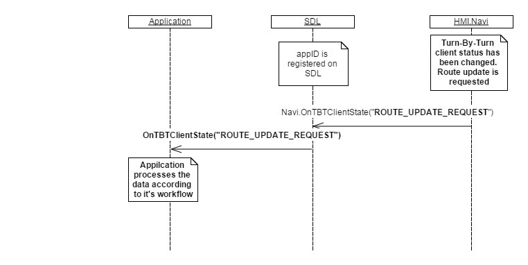

## OnTBTClientState

Type
: Notification

Sender
: HMI

Purpose
: Provide SDL with information about changes to the TBT client state.

### Notification

#### Parameters

|Name|Type|Mandatory|Additional|
|:---|:---|:--------|:---------|
|state|[Common.TBTState](../../common/enums/#tbtstate)|true||

### Sequence Diagrams
|||
OnTBTClientState

|||

### Example Notification
```json
{
  "jsonrpc" : "2.0",
  "method" : "Navigation.OnTBTClientState",
  "params" :  
  {
    "state" : "NEXT_TURN_REQUEST"
  }
}
```
