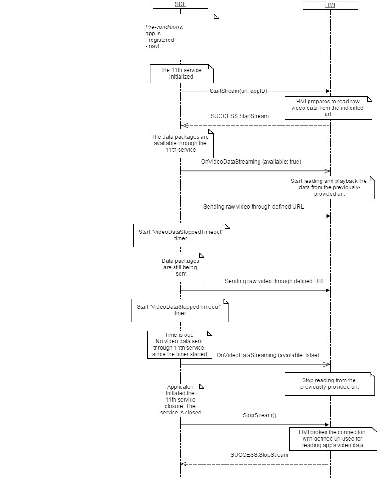

## OnVideoDataStreaming

Type
: Notification

Sender
: SDL

Purpose
: Notify the HMI about a raw video data stream which should be visible to the user while in that application's context.

### Notification

#### Parameters

|Name|Type|Mandatory|Additional|
|:---|:---|:--------|:---------|
|available|Boolean|true||

### Sequence Diagrams
|||
OnVideoDataStreaming

|||

#### JSON Example Notification
```json
{
  "jsonrpc" : "2.0",
  "method" : "Navigation.OnVideoDataStreaming",
  "params" :  
  {
    "available" : true
  }
}
```
