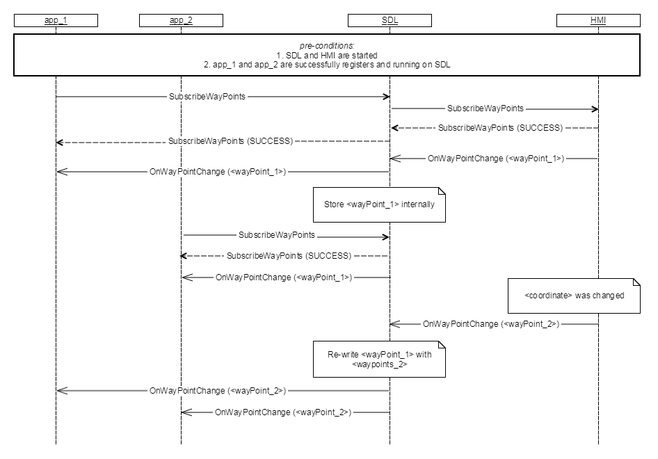

## OnWayPointChange

Type
: Notification

Sender
: HMI

Purpose
: To provide the entire LocationDetails when there is a change to any waypoints or destination

SDL notifies successfully subscribed app about any changes to WayPoints or Destination value.

!!! MUST  
1. Notify SDL with the details of the destination and waypoints in case wayPoint-related data was changed/updated. 
 


#### Parameters
|Name|Type|Mandatory|Additional|
|:---|:---|:--------|:---------|
|wayPoints|Common.LocationDetails|true|array="true"<br>minsize="0"<br>maxsize="10"|

### Sequence Diagram
|||
OnWayPointChange

|||
OnWayPointChange for newly subscribed application

|||

#### JSON Example Notification
```json
{
	"jsonrpc" : "2.0",
	"method" : "Navigation.OnWayPointChanged",
	"params" :  
	{
		“wayPoints” :
		[
			{
				“phoneNumber” :  navigationText1,
				“addressLines” : “addresstext”
			},
		“appID” : 26743
	} 
}
```
