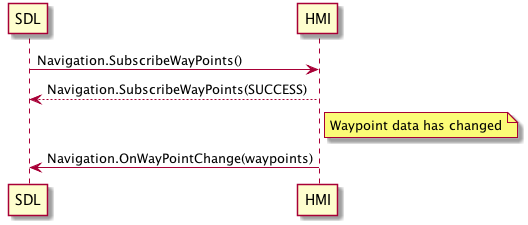

## OnWayPointChange

Type
: Notification

Sender
: HMI

Purpose
: Notify SDL of navigation waypoint/destination updates

### Notification

!!! MUST
Send this notification when the list of waypoints is changed and SDL is subscribed to waypoint updates
!!!

#### Parameters

|Name|Type|Mandatory|Additional|Description|
|:---|:---|:--------|:---------|:----------|
|wayPoints|[Common.LocationDetails](../../common/structs/#locationdetails)|true|array: true<br>minsize: 1<br>maxsize: 10||

### Sequence Diagrams
|||
OnWayPointChange

|||

### Example Notification

```json
{
  "id" : 47,
  "jsonrpc" : "2.0",
  "method" : "Navigation.OnWayPointChange",
  "params" : {
    "wayPoints" :
    [
      {
        "phoneNumber" :  "123-456-7890",
        "addressLines" : "addresstext"
      }
    ]
  }
}
```
