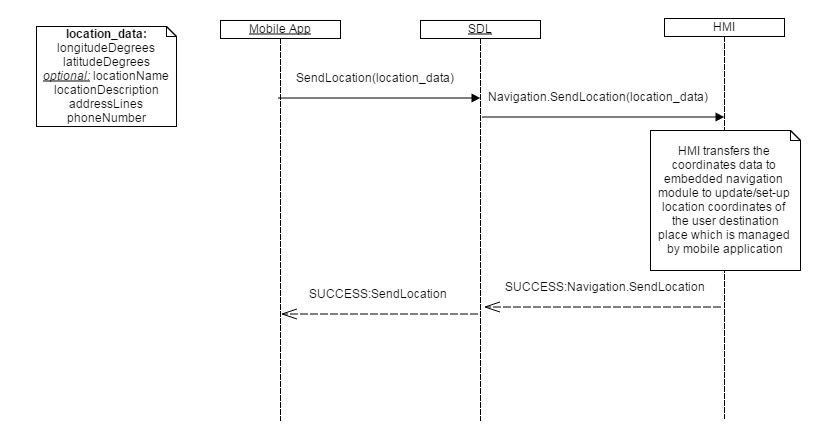
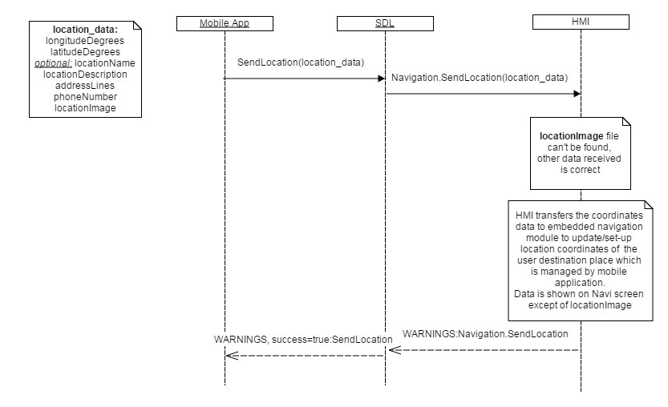
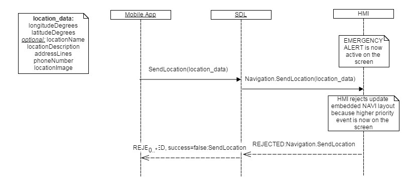
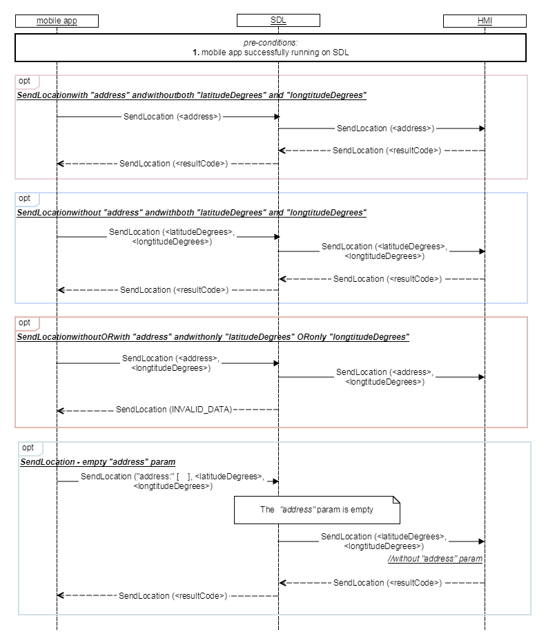

## SendLocation

Type
: Function

Sender
: SDL

Purpose
: Allow a connected application to send a destination to the embedded navigation system.

### Behavior

!!! must  
1. Transfer data received from SDL to navigation embedded module. Navigation embedded HU system should update the location data on the embedded navi screen.  
2. Send a `SUCCESS` response to SDL in case the destination data has been obtained.
3. Ignore`<deliveryMode>`, `<timeStampParams>`,`<address>` parameters  in case HMI does not support them  (note: app will not know whether the whole information was processed by HMI).
4. Respond with `WARNINGS` and “info: were not processed”” to SDL in case HMI partially supports `<deliveryMode>`, `<timeStampParams>`,`<address>`(SDL will transfer it to mobile app).
5. Respond with `REJECTED` result code to SDL in case HMI is currently busy with a higher-priority event or other reasons defined for the mentioned resultCode by HMI.
6. Send `OnResetTimeout` notification to SDL for reseting timeout in case HMI needs more time for processing user's selection.

### Request

#### Parameters

|Name|Type|Mandatory|Additional|
|:---|:---|:--------|:---------|
|appID|Integer|true||
|longitudeDegrees|Float|false|minvalue: -180<br>maxvalue: 180|
|latitudeDegrees|Float|false|minvalue: -90<br>maxvalue: 90|
|locationName|String|false|maxlength: 500|
|locationDescription|String|false|maxlength: 500|
|addressLines|String|false|array: true<br>minsize: 0<br>maxsize: 4<br>maxlength: 500|
|phoneNumber|String|false|maxlength: 500|
|locationImage|[Common.Image](../../common/structs/#image)|false||
|deliveryMode|[Common.DeliveryMode](../../common/enums/#deliverymode)|false||
|timeStamp|[Common.DateTime](../../common/structs/#datetime)|false||
|address|[Common.OASISAddress](../../common/structs/#oasisaddress)|false||

### Response

#### Parameters

This RPC has no additional parameter requirements

### Sequence Diagrams

|||
SendLocation Success

|||

|||
SendLocation Fail with warnings

|||

|||
SendLocation Fail Rejected

|||

|||
SendLocation General behavior

|||

### JSON Message Examples

#### Example Request

```json
{
  "id" : 138,
  "jsonrpc" : "2.0",
  "method" : "Navigation.SendLocation",
  "params" :
  {
    "longitudeDegrees" : 139.34,
    "latitudeDegrees" : 35.36,
    "locationName" : "Ford Repair",
    "locationImage" :
    {
         "value" : "tmp/SDL/app/Navi/12345.jpg",
         "imageType" : "DYNAMIC"
    },
    "appID" : 65368
  }
}
```

#### Example Response

```json
{
  "id" : 138,
  "jsonrpc" : "2.0",
  "result" :
  {
    "code" : 0,
    "method" : "Navigation.SendLocation"
  }
}
```

#### Example Error

```json
{
  "id" : 138,
  "jsonrpc" : "2.0",
  "error" :
  {
    "code" : 22,
    "message" : " The unknown issue occurred ",
    "data" :
    {
      "method" : "Navigation.SendLocation"
    }
  }
}
```
