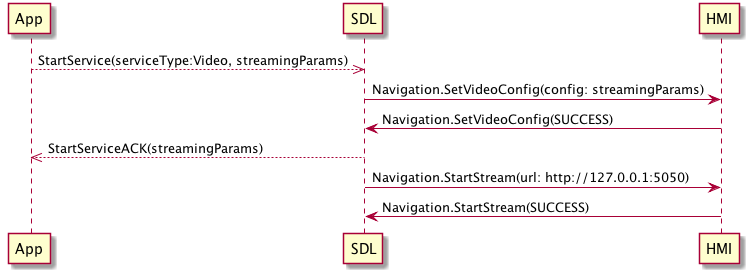
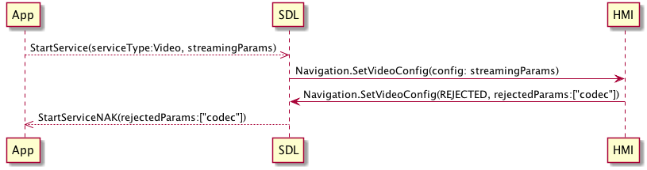

## SetVideoConfig

Type
: Function

Sender
: SDL

Purpose
: Negotiate parameters for a new video stream

`Navigation.SetVideoConfig` represents a request from the app to determine whether a given video streaming configuration is supported by the HMI.

!!! must

The HMI must return a `SUCCESS` result code if it is able to handle a stream with the provided parameters.

!!!

!!! must

The HMI must return a `REJECTED` result code if it is not able to handle a stream with the provided parameters, with any such parameters being included in `rejectedParams`.

!!!

### Request

#### Parameters

|Name|Type|Mandatory|Additional|
|:---|:---|:--------|:---------|
|config|[Common.VideoConfig](../../common/structs/#videoconfig)|true||
|appID|Integer|true||

### Response

#### Parameters

|Name|Type|Mandatory|Additional|
|:---|:---|:--------|:---------|
|rejectedParams|String|true|array: true<br>minsize: 1<br>maxsize: 1000|

### Sequence Diagrams

|||
SetVideoConfig basic flow

|||

|||
SetVideoConfig error flow

|||

### Example Request

```json
{
  "id" : 70,
  "jsonrpc" : "2.0",
  "method" : "Navigation.SetVideoConfig",
  "params" :
  {
    "config" : 
    {
      "codec": "H264",
      "protocol": "RTP",
      "width": 800,
      "height": 600
    },
    "appID" : 65464
  }
}
```

### Example Response

```json
{
  "id" : 70,
  "jsonrpc" : "2.0",
  "result" :
  {
    "code" : 0,
    "method" : "Navigation.SetVideoConfig"
  }
}
```

### Example Error

```json
{
  "id" : 70,
  "jsonrpc" : "2.0",
  "result" :
  {
    "code" : 4,
    "rejectedParams": ["codec", "width"],
    "method" : "Navigation.SetVideoConfig"
  }
}
```
