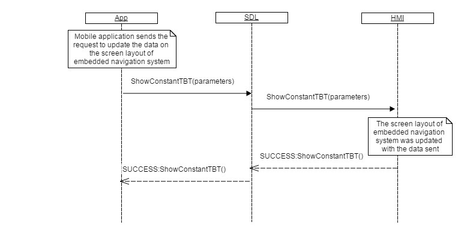

## ShowConstantTBT

Type
: Function

Sender
: SDL

Purpose
: Update navigation information of the embedded navigation system.

### Request

#### Parameters

|Name|Type|Mandatory|Additional|
|:---|:---|:--------|:---------|
|navigationTexts|[Common.TextFieldStruct](../../common/structs/#textfieldstruct)|true|array: true<br>minsize: 0<br>maxsize: 5|
|turnIcon|[Common.Image](../../common/structs/#image)|false||
|nextTurnIcon|[Common.Image](../../common/structs/#image)|false||
|distanceToManeuver|Float|true|minvalue: 0<br>maxvalue: 1000000000|
|distanceToManeuverScale|Float|true|minvalue: 0<br>maxvalue: 1000000000|
|maneuverComplete|Boolean|false||
|softButtons|[Common.SoftButton](../../common/structs/#softbutton)|false|array: true<br>minsize: 0<br>maxsize: 3|
|appID|Integer|true||

### Response

#### Parameters

This RPC has no additional parameter requirements

### Sequence Diagrams
|||
ShowConstantTBT

|||

### Example Request

```json
{
  "id" : 543,
  "jsonrpc" : "2.0",
  "method" : "Navigation.ShowConstantTBT",
  "params" :
  {
    "navigationTexts" :
    [
      {
        "fieldName" :  navigationText1,
        "fieldText" : "Destination point: Berlin"
      },
      {
        "fieldName" :  ETA,
        "fieldText" : "15:45"
      },
      {
        "fieldName" :  totalDistance,
        "fieldText" : "658"
      }
    ],
    "turnIcon" :
    [
         "value" : "tmp/SDL/app/Navi/icon_3245.jpeg",
         "imageType" : DYNAMIC
    ],
    "distanceToManeuver" : 168,
    "distanceToManeuverScale" : 265,
    "softButtons" :
    [
        "type" :  TEXT,
        "text" : "Close",
        "softButtonID" : 76,
        "systemAction" :  DEFAULT_ACTION
    ],
    "appID" : 26743
  }
}
```
### Example Response

```json
{
  "id" : 543,
  "jsonrpc" : "2.0",
  "result" :
  {
    "code" : 0,
    "method" : "Navigation.ShowConstantTBT"
  }
}
```

### Example Error

```json
{
  "id" : 543,
  "jsonrpc" : "2.0",
  "error" :
  {
    "code" : 5,
    "message" : " A command was aborted",
    "data" :
    {
      "method" : "Navigation.ShowConstantTBT"
    }
  }
}
```
