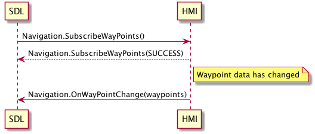

## SubscribeWayPoints

Type
: Function

Sender
: SDL

Purpose
: To subscribe in getting changes for available Waypoints/destinations data

### Behavior

!!! MUST

1. Accept requests to subscribe to WayPoints and Destination.
2. Provide a response of SUCCESS to the request and the details of the WayPoints and Destination within the response.
3. Send the updated details to mobile app when any change to the WayPoints or Destination data happens.  
4. Responds with UNSUPPORTED_RESOURCE in case navigation interface is not available on HMI.

!!!


### Sequence Diagram
|||
SubscribeWayPoints

|||
### Example Request
```json
{
	"id" : 42,
	"jsonrpc" : "2.0",
	"method" : "Navigation.SubscribeWayPoints"
}
```
### Example Response
```json
{
	"id" : 42,
	"jsonrpc" : "2.0",
	"result" : 
	{
		"code" : 0,
		"method" : " Navigation.SubscribeWayPoints "
	}
}
```

### Example Error

```json
{
	"id" : 42,
	"jsonrpc" : "2.0",
	"error" : 
	{
		"code" : 11,
		"message" : " Invalid json or parameters are out of bounds.",
		"data" : 
		{
			"method" : "Navigation.SubscribeWayPoints"
		}
	}
}

```
