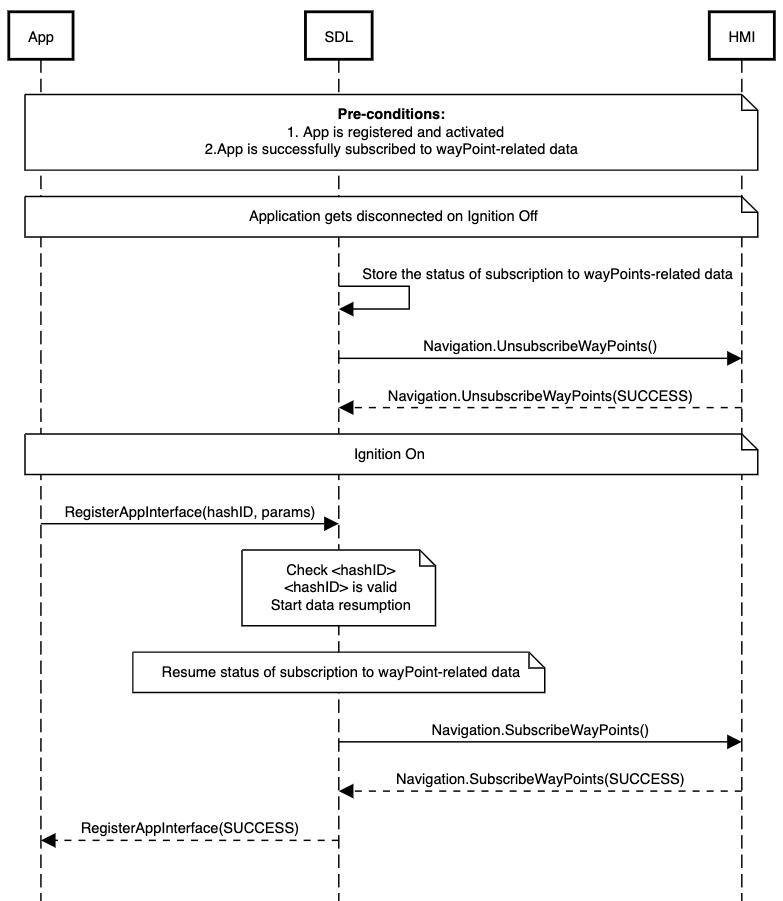

## SubscribeWayPoints

Type
: Function

Sender
: SDL

Purpose
: Subscribe to periodic navigation waypoint/destination updates

### Request

!!! MUST
1. Send future waypoint updates to SDL using [Navigation.OnWayPointChange](../onwaypointchange).
2. Send `BC.OnResetTimeout` notification to SDL to reset the timeout in case HMI needs more time to process the request.
!!!

!!! note
SDL restores status of subscription to wayPoints-related data during data resumption during 3 consecutive ignition cycles.
!!!

#### Parameters

This RPC has no additional parameter requirements

### Response

#### Parameters

This RPC has no additional parameter requirements

### Sequence Diagrams

|||
SubscribeWayPoints

|||

|||
SubscribeWayPoints Resumption

|||

### JSON Message Examples

#### Example Request

```json
{
  "id" : 47,
  "jsonrpc" : "2.0",
  "method" : "Navigation.SubscribeWayPoints",
  "params" : {}
}
```

#### Example Response

```json
{
  "id" : 47,
  "jsonrpc" : "2.0",
  "result" :
  {
    "code" : 0,
    "method" : "Navigation.SubscribeWayPoints"
  }
}
```

#### Example Error

```json
{
  "id" : 47,
  "jsonrpc" : "2.0",
  "error" :
  {
    "code" : 6,
    "message" : "Already subscribed to waypoints",
    "data" :
    {
      "method" : "Navigation.SubscribeWayPoints"
    }
  }
}
```
