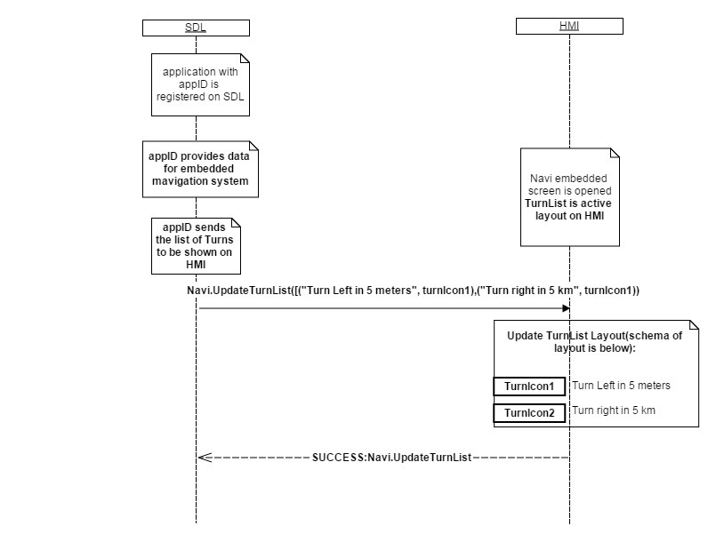

## UpdateTurnList


### Request

#### Parameters

|Name|Type|Mandatory|Additional|Description|
|:---|:---|:--------|:---------|:----------|
|turnList|Common.Turn|false|array: true<br>minsize: 1<br>maxsize: 100||
|softButtons|Common.SoftButton|false|array: true<br>minsize: 0<br>maxsize: 1||
|appID|Integer|true|||

#### Turn

|Name|Type|Mandatory|Additional|Description|
|:---|:---|:--------|:---------|:----------|
|navigationText|Common.TextFieldStruct|false|||
|turnIcon|Common.Image|false|||

#### SoftButton

|Name|Type|Mandatory|Additional|Description|
|:---|:---|:--------|:---------|:----------|
|type|Common.SoftButtonType|true|||
|text|String|false|maxlength: 500||
|image|Common.Image|false|||
|isHighlighted|Boolean|false|||
|softButtonID|Integer|true|minvalue: 0<br>maxvalue: 65535||
|systemAction|Common.SystemAction|true|||

### Response

#### Parameters

This RPC has no additional parameter requirements

### Sequence Diagrams
|||
UpdateTurnList

|||

### Example Request

```json
{
	"id" : 176,
	"jsonrpc" : "2.0",
	"method" : "Navigation.UpdateTurnList",
	"params" :
	{
		"turnList" :
		[
			{
				"navigationText" :  
				[
					"fieldName" :  navigationText,
					"fieldText" : "Turn Right"
				],
				"turnIcon" :
				[
				 	"value" : "tmp/SDL/app/Navi/icon_turn_right.jpeg",
				 	"imageType" :  DYNAMIC
				]
			},

			{
				"navigationText" :  
				[
					"fieldName" :  navigationText,
					"fieldText" : "Turn Left"
				],
				"turnIcon" :
				[
				 	"value" : "tmp/SDL/app/Navi/icon_turn_left.jpeg",
				 	"imageType" :  DYNAMIC
				]
			},

			{
				"navigationText" :  
				[
					"fieldName" :  navigationText,
					"fieldText" : "Go Forward"
				],
				"turnIcon" :
				[
				 	"value" : "tmp/SDL/app/Navi/icon_go_forward.jpeg",
				 	"imageType" :  DYNAMIC
				]
			}
		],

		"softButtons" :
		[
				"type" :  BOTH,
				"text" : "Return",
				"image" :
				[
				 	"value" : "tmp/SDL/app/Navi/icon_583.jpg",
				 	"imageType" : DYNAMIC
				],
				"isHighlighted" : true,
				"softButtonID" : 118,
				"systemAction" :  DEFAULT_ACTION
		]
	}
}
```
### Example Response

```json
{
	"id" : 176,
	"jsonrpc" : "2.0",
	"result" :
	{
		"code" : 0,
		"method" : "Navigation.UpdateTurnList"
	}
}
```

### Example Error

```json
{
	"id" : 176,
	"jsonrpc" : "2.0",
	"error" :
	{
		"code" : 4,
		"message" : " A command was rejected because a higher priority command is requested",
		"data" :
		{
			"method" : "Navigation.UpdateTurnList"
		}
	}
}
```
