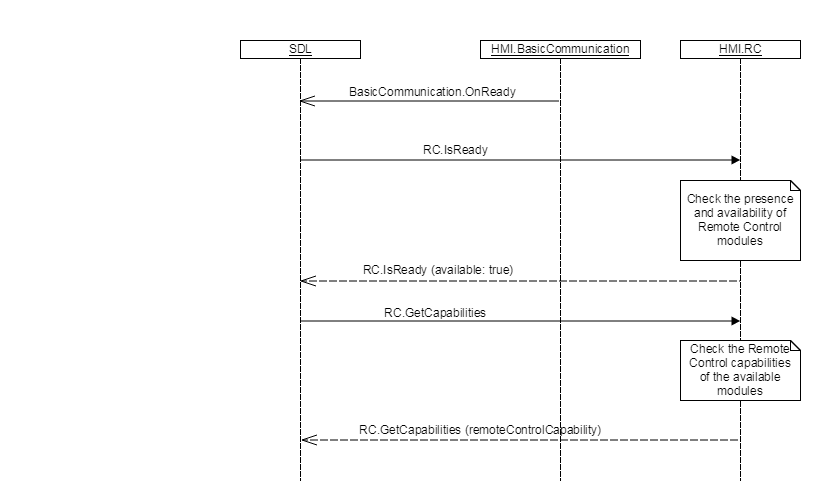

## GetCapabilities

Type
: Function

Sender
: SDL

Purpose
: Inform SDL of the Remote Control capabilities of HMI, invoked at system startup.

GetCapabilities is a request originated by SDL Core after receiving an `IsReady` Response from the Remote Control interface. If the HMI responds to GetCapabilities with the `RemoteControlCapabilities` parameter, this struct will overwrite any Remote Control related capabilities that are stored in the [hmi_capabilities.json](https://github.com/smartdevicelink/sdl_core/blob/master/src/appMain/hmi_capabilities.json) configuration file.

The `RemoteControlCapabilities` struct will be stored by SDL Core, and used when a mobile application performs a `GetSystemCapability` request.
### Request

#### Parameters

This RPC has no additional parameter requirements

### Response

#### Parameters

|Name|Type|Mandatory|Additional|
|:---|:---|:--------|:---------|
|remoteControlCapability|[Common.RemoteControlCapabilities](../../common/structs/#remotecontrolcapabilities)|false|See RemoteControlCapabilities, all available RC modules and buttons shall be returned|

### Sequence Diagrams

|||
GetCapabilities

|||

### Example Request

```json
{
  "id":22,
  "jsonrpc":"2.0",
  "method":"RC.GetCapabilities"
}
```

### Example Response

```json
{
  "id": 22,
  "jsonrpc": "2.0",
  "result": {
    "code": 0,
    "method": "RC.GetCapabilities",
    "remoteControlCapability": {
      "buttonCapabilities": [
        {
          "longPressAvailable": true,
          "name": "AC_MAX",
          "shortPressAvailable": true,
          "upDownAvailable": true
        },
        {
          "longPressAvailable": true,
          "name": "AC",
          "shortPressAvailable": true,
          "upDownAvailable": true
        },
        {
          "longPressAvailable": true,
          "name": "RECIRCULATE",
          "shortPressAvailable": true,
          "upDownAvailable": true
        },
        {
          "longPressAvailable": true,
          "name": "FAN_UP",
          "shortPressAvailable": true,
          "upDownAvailable": true
        },
        {
          "longPressAvailable": true,
          "name": "FAN_DOWN",
          "shortPressAvailable": true,
          "upDownAvailable": true
        },
        {
          "longPressAvailable": true,
          "name": "TEMP_UP",
          "shortPressAvailable": true,
          "upDownAvailable": true
        },
        {
          "longPressAvailable": true,
          "name": "TEMP_DOWN",
          "shortPressAvailable": true,
          "upDownAvailable": true
        },
        {
          "longPressAvailable": true,
          "name": "DEFROST_MAX",
          "shortPressAvailable": true,
          "upDownAvailable": true
        },
        {
          "longPressAvailable": true,
          "name": "DEFROST",
          "shortPressAvailable": true,
          "upDownAvailable": true
        },
        {
          "longPressAvailable": true,
          "name": "DEFROST_REAR",
          "shortPressAvailable": true,
          "upDownAvailable": true
        },
        {
          "longPressAvailable": true,
          "name": "UPPER_VENT",
          "shortPressAvailable": true,
          "upDownAvailable": true
        },
        {
          "longPressAvailable": true,
          "name": "LOWER_VENT",
          "shortPressAvailable": true,
          "upDownAvailable": true
        },
        {
          "longPressAvailable": true,
          "name": "VOLUME_UP",
          "shortPressAvailable": true,
          "upDownAvailable": true
        },
        {
          "longPressAvailable": true,
          "name": "VOLUME_DOWN",
          "shortPressAvailable": true,
          "upDownAvailable": true
        },
        {
          "longPressAvailable": true,
          "name": "EJECT",
          "shortPressAvailable": true,
          "upDownAvailable": true
        },
        {
          "longPressAvailable": true,
          "name": "SOURCE",
          "shortPressAvailable": true,
          "upDownAvailable": true
        },
        {
          "longPressAvailable": true,
          "name": "SHUFFLE",
          "shortPressAvailable": true,
          "upDownAvailable": true
        },
        {
          "longPressAvailable": true,
          "name": "REPEAT",
          "shortPressAvailable": true,
          "upDownAvailable": true
        }
      ],
      "climateControlCapabilities": [
        {
          "acEnableAvailable": true,
          "acMaxEnableAvailable": true,
          "autoModeEnableAvailable": true,
          "circulateAirEnableAvailable": true,
          "currentTemperatureAvailable": true,
          "defrostZone": [
            "FRONT",
            "REAR",
            "ALL",
            "NONE"
          ],
          "defrostZoneAvailable": true,
          "desiredTemperatureAvailable": true,
          "dualModeEnableAvailable": true,
          "fanSpeedAvailable": true,
          "moduleName": "Climate",
          "ventilationMode": [
            "UPPER",
            "LOWER",
            "BOTH",
            "NONE"
          ],
          "ventilationModeAvailable": true
        }
      ],
      "radioControlCapabilities": [
        {
          "availableHDsAvailable": true,
          "hdChannelAvailable": true,
          "moduleName": "Radio",
          "radioBandAvailable": true,
          "radioEnableAvailable": true,
          "radioFrequencyAvailable": true,
          "rdsDataAvailable": true,
          "signalChangeThresholdAvailable": true,
          "signalStrengthAvailable": true,
          "stateAvailable": true
        }
      ]
    }
  }
}
```
### Example Error

```json
{
  "id" : 22,
  "jsonrpc" : "2.0",
  "error" :
  {
    "code" : 22,
    "message" : "During API call the unknown error has occurred",
    "data" :
    {
      "method" : "RC.GetCapabilities"
    }
  }
}
```
