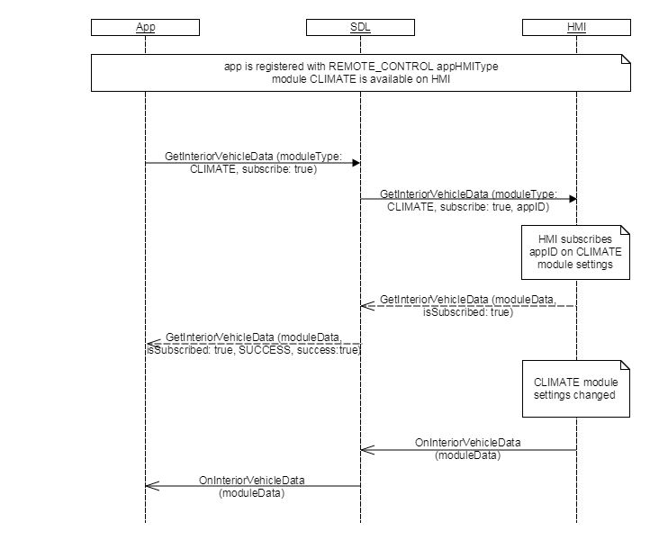

## GetInteriorVehicleData

Type
: Function

Sender
: SDL

Purpose
: To read RC module status data. The same function is used to subscribe/unsubscribe to RC module status/setting change notifications.

GetInteriorVehicleData is a request originated by a Remote Control Mobile Application.  
If the parameter `subscribe` is set to `true`, the mobile application has requested to subscribe to the module data defined by `moduleId` + `moduleType` parameters.  
SDL core allocates resources by a module (`moduleId` + `moduleType`).
SDL needs to subscribe to a module if there is at least one app that subscribes to the module. SDL needs to unsubscribe from a module if no apps subscribe to the module.  

SDL forwards a GetInteriorVehicleData request to HMI only if there is no cached data available for the requested module (`moduleId` + `moduleType`) or it needs to subscribe to/unsubscribe from the module from HMI.  
Otherwise, SDL responds to the request with the cached data without forwarding it to HMI.

The HMI should return interior vehicle data that corresponds to the requested module (`moduleId` + `moduleType`).

### Request  

GetInteriorVehicleData is a request originated by a Remote Control Mobile Application. 
If the optional `moduleId` is not provided in a GetInteriorVehicleData_request from a Remote Control Mobile Application, and if there is at least one module (published by capabilities) of the same moduleType, SDL core will use the default `moduleId` (the moduleId of first module provided in RC capabilities for requested `moduleType`) when processing the request.

If the parameter `subscribe` is set to true, the mobile application has requested to subscribe to the module data defined by the [`moduleType`](../../common/enums/#moduletype) parameter.

#### Parameters

|Name|Type|Mandatory|Additional|Description|
|:---|:---|:--------|:---------|:---------------|
|moduleType|[Common.ModuleType](../../common/enums/#moduletype)|true||The type of a RC module to retrieve module data from the vehicle. <br> In the future, this should be the Identification of a module.|
|moduleId|String|false|maxlength="100"|Id of a module, published by System Capability.|
|subscribe|Boolean|false|defvalue="false"|If subscribe is true, the head unit will register OnInteriorVehicleData notifications for the requested module (moduleId and moduleType). <br> If subscribe is false, the head unit will unregister OnInteriorVehicleData notifications for the requested module (moduleId and moduleType). <br> If subscribe is not included, the subscription status of the app for the requested module (moduleId and moduleType) will remain unchanged.|

### Response

HMI must provide optional `moduleId` param  in GetInteriorVehicleData_response.
HMI must return in GetInteriorVehicleData_response the current value of the display mode used in HMI if `moduleType = HMI_SETTINGS` .

#### Parameters

|Name|Type|Mandatory|Additional|
|:---|:---|:--------|:---------|
|moduleData|[Common.ModuleData](../../common/structs/#moduledata)|true||
|isSubscribed|Boolean|false||

### Sequence Diagrams

|||
GetInteriorVehicleData

|||

### Example Request

```json
{
    "id": 122,
    "jsonrpc": "2.0",
    "method": "RC.GetInteriorVehicleData",
    "params": {
        "moduleType": "CLIMATE",
        "subscribe": true
    }
}
```

### Example Response

```json
{
    "id": 122,
    "jsonrpc": "2.0",
    "result": {
        "code": 0,
        "isSubscribed": true,
        "method": "RC.GetInteriorVehicleData",
        "moduleData": {
            "climateControlData": {
                "acEnable": true,
                "acMaxEnable": true,
                "autoModeEnable": true,
                "circulateAirEnable": true,
                "currentTemperature": {
                    "unit": "FAHRENHEIT",
                    "value": 20.1
                },
                "defrostZone": "FRONT",
                "desiredTemperature": {
                    "unit": "CELSIUS",
                    "value": 10.5
                },
                "dualModeEnable": true,
                "fanSpeed": 50,
                "ventilationMode": "BOTH"
            },
            "moduleType": "CLIMATE"
        }
    }
}

```

### Example Error

```json
{
    "error": {
        "code": 2,
        "data": {
            "method": "RC.GetInteriorVehicleData"
        },
        "message": "Unknown module type"
    },
    "id": 122,
    "jsonrpc": "2.0"
}
```
