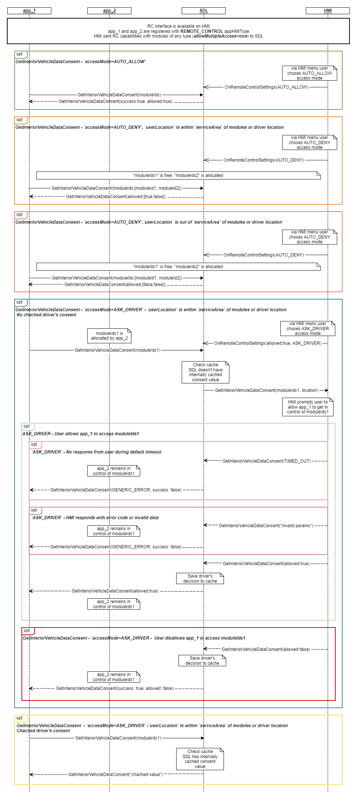

## GetInteriorVehicleDataConsent

Type
: Function

Sender
: SDL

Purpose
: Request for driver's permission to RC module for the specified application

RC.GetInteriorVehicleDataConsent is sent to the HMI if:
1. The [access mode](../../common/enums/#rcaccessmode) is `ASK_DRIVER` and
2. An application (in HMILevel FULL) requests access to an RC module that is already in use by another application.

The `AUTO_ALLOW` and `AUTO_DENY` RC access modes are automatically handled by SDL. For more information about consent rules, see the [Remote Control Consent](https://smartdevicelink.com/en/guides/core/feature-documentation/remote-control-guide/#consent) section.

The HMI is expected to display a permission prompt to the driver showing the RC module and app details (for example, app's name).
The driver is expected to have an ability to grant or deny the permission.

!!! must
1. HMI must prompt user to make selection of resource allocation
2. Respond to SDL with user choice within RC.GetInteriorVehicleDataConsent response
3. Send BC.OnResetTimeout notification to SDL for reseting timeout in case HMI needs more time for processing RC.GetInteriorVehicleDataConsent request
4. Send TIMED_OUT to SDL if user didn't make choice after default timeout expires
!!!

### Request

#### Parameters

|Name|Type|Mandatory|Additional|Description|
|:---|:---|:--------|:---------|:----------|
|moduleType|[Common.ModuleType](../../common/enums/#moduletype)|true| |The module type that the app requests to control|
|moduleIds|String|false|array: true<br>maxlength: 100|Ids of a module of same type, published by System Capability|
|appID|Integer|true| |ID of the application that triggers the permission prompt|

### Response

#### Parameters

|Name|Type|Mandatory|Additional|Description|
|:---|:---|:--------|:---------|:----------|
|allowed|Boolean|true|array: true|"true" - if the driver grants the permission for controlling to the named app; <br> "false" - in case the driver denies the permission for controlling to the named app.|

### Sequence Diagrams

|||
GetInteriorVehicleDataConsent

|||

### JSON Message Examples

#### Example Request

```json
{
    "id": 38,
    "jsonrpc": "2.0",
    "method": "RC.GetInteriorVehicleDataConsent",
    "params": {
        "appID": 2032286926,
        "moduleType": "CLIMATE"
    }
}
```

#### Example Response

```json
{
    "id": 38,
    "jsonrpc": "2.0",
    "result": {
        "allowed": [true, false],
        "code": 0,
        "method": "RC.GetInteriorVehicleDataConsent"
    }
}
```

#### Example Error

```json
{
    "error": {
        "code": 10,
        "data": {
            "method": "RC.GetInteriorVehicleDataConsent"
        },
        "message": "No response from driver"
    },
    "id": 38,
    "jsonrpc": "2.0"
}
```
