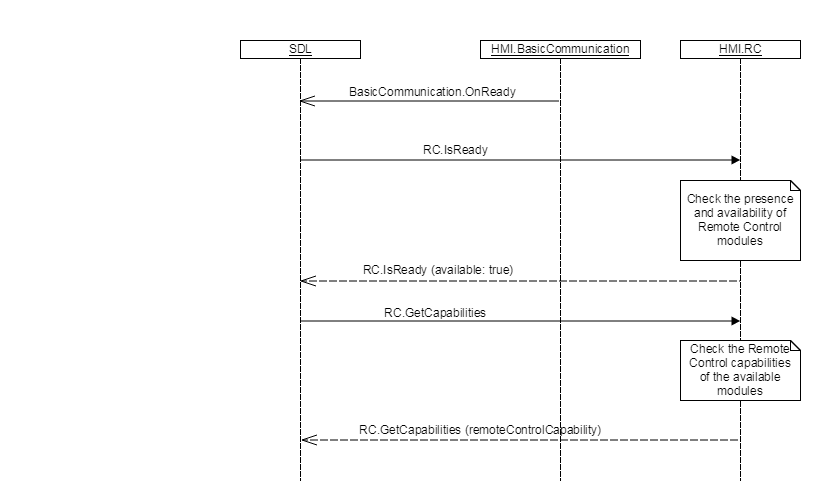

## IsReady

Type
: Function

Sender
: SDL

Purpose
: Provide information to SDL about presence of any of remote controllable module and its readiness to cooperate with SDL, invoked at SDL system start up.


### Request

#### Parameters

This RPC has no additional parameter requirements

!!! note

1. SDL sends `RC.IsReady` request after HMI confirms its readiness via `BC.OnReady` notification.
2. If HMI responds with `"available":false`, SDL will not further communicate over RC interface with HMI.
3. If HMI does not respond during SDL's default timeout, SDL will continue to send RPCs over RC interface to HMI.

!!!

### Response

!!! must

1. Check whether RC component is available and ready.
2. Respond correspondingly to results of this check.

!!!

#### Parameters

|Name|Type|Mandatory|Description|
|:---|:---|:--------|:----------|
|available|Boolean|true|Must be true if vehicle RC modules are present and ready to communicate with SDL.|

### Sequence Diagrams

|||
IsReady

|||

### JSON Message Examples

#### Example Request

```json
{
  "id" : 8,
  "jsonrpc" : "2.0",
  "method" : "RC.IsReady"
}
```

#### Example Response

```json
{
  "id" : 8,
  "jsonrpc" : "2.0",
  "result" :
  {
    "available" : true,
    "code" : 0,
    "method" : "RC.IsReady"
  }
}
```

#### Example Error

```json
{
  "id" : 8,
  "jsonrpc" : "2.0",
  "error" :
  {
    "code" : 22,
    "message" : " HMI doesn’t have the information about RC availability or some failure occurred ",
    "data" :
    {
      "method" : "RC.IsReady"
    }
  }
}
```
