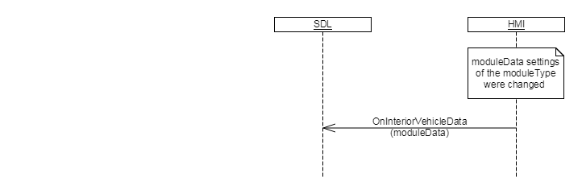

## OnInteriorVehicleData

Type
: Notification

Sender
: HMI

Purpose
: Inform SDL about any changes in RC module settings.

!!! must

The HMI must send RC.OnInteriorVehicleData notification to SDL when module settings were changed in case of button press event or after SetInteriorVehicledata request was processed

!!!

### Notification

#### Parameters

|Name|Type|Mandatory|Additional|
|:---|:---|:--------|:---------|
|moduleData|[Common.ModuleData](https://github.com/smartdevicelink/sdl_hmi_integration_guidelines/blob/master/docs/Common/Structs/index.md)|true||

### Sequence Diagrams

|||
OnInteriorVehicledata

|||

#### JSON Example Notification
```json
{
    "jsonrpc": "2.0",
    "method": "RC.OnInteriorVehicleData",
    "params": {
        "moduleData": {
            "climateControlData": {
                "acEnable": false,
                "acMaxEnable": false,
                "autoModeEnable": true,
                "circulateAirEnable": false,
                "currentTemperature": {
                    "unit": "FAHRENHEIT",
                    "value": 44.3
                },
                "defrostZone": "ALL",
                "desiredTemperature": {
                    "unit": "CELSIUS",
                    "value": 22.6
                },
                "dualModeEnable": true,
                "fanSpeed": 65,
                "ventilationMode": "UPPER"
            },
            "moduleType": "CLIMATE"
        }
    }
}
```
