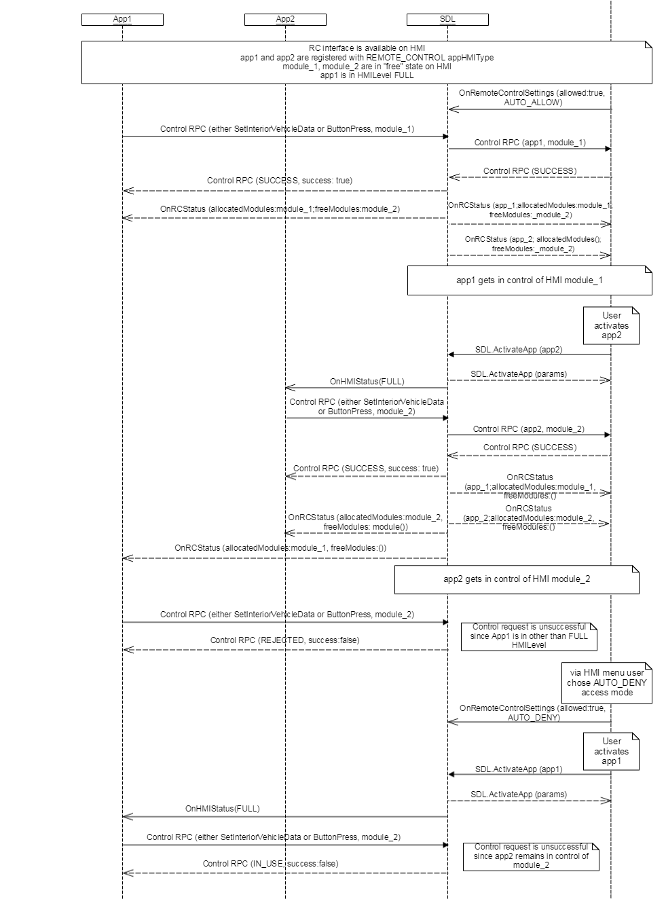

## OnRCStatus

Type
: Notification

Sender
: SDL

Purpose
: Inform HMI and mobile application about changes in RC module allocation.


### Notification

SDL must send OnRCStatus notification when:
    * RC application registers with SDL
    * A module is allocated to an application 
    * A module is de-allocated from an application (the module is freed when application exits, disconnects, goes to HMI level NONE)
    * An application no longer has the right to control the module (for example, a policy update can revoke the application's access to a module)

#### Parameters

|Name|Type|Mandatory|Additional|Description|
|:---|:---|:--------|:---------|:----------|
|appID|Integer|true||ID of selected application|
|allocatedModules|[Common.ModuleData](../../common/structs/#moduledata)|true|array: true<br>minsize: 0<br>maxsize: 100|Contains a list (zero or more) of module types that are allocated to the application|
|freeModules|[Common.ModuleData](../../common/structs/#moduledata)|true|array: true<br>minsize: 0<br>maxsize: 100|Contains a list (zero or more) of module types that are free to access for the application|

#### JSON Example Notification

```json
{
	"jsonrpc": "2.0",
	"method": "RC.OnRCStatus",
	"params": {
		"allocatedModules": [],
		"freeModules": [{
				"moduleType": "CLIMATE"
			},
			{
				"moduleType": "RADIO"
			},
			{
				"moduleType": "AUDIO"
			},
			{
				"moduleType": "LIGHT"
			},
			{
				"moduleType": "HMI_SETTINGS"
			},
			{
				"moduleType": "SEAT"
			}
		]
	}
}
```

### Sequence Diagrams

|||
OnRCStatus

|||