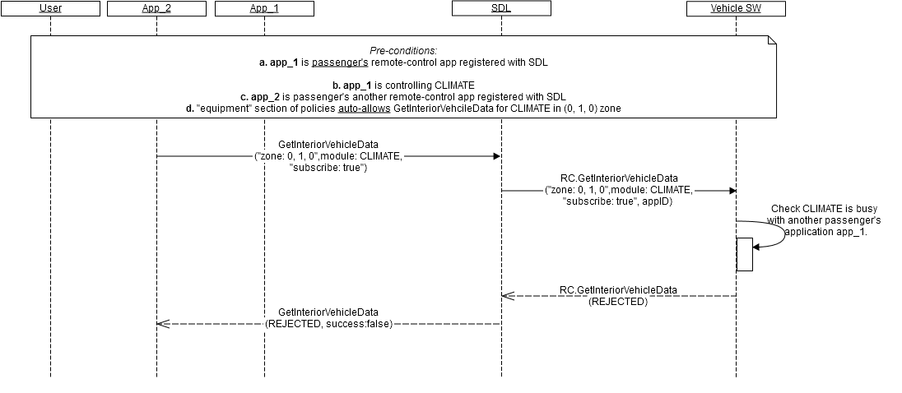

## RC.GetInteriorVehicleData
Type
:	Function

Sender
:	SDL

Purpose
:	Obtain vehicle data and/or subscribe to notifications from the specified module in the specified location

_**Trigger to send:**_   
RSDL sends _RC.GetInteriorVehicleData_ to the vehicle:
   1.	After receiving a valid _GetInteriorVehicleData_ request from remote-control application.
   2.	Following the internal logic with the purpose to unsubscribe the application from notifications.

_**Error handling:**_   
RSDL has a logic to _read the capabilities from the predefined file_ so that to respond to the application in case _the vehicle fails to respond or responds with error_ to _RC.GetInteriorVehicleDataCapabilities_.

1.	RSDL validates response from the vehicle and in case it's invalid, RSDL returns GENERIC_ERROR result to the corresponding mobile application's request.   
_Validation includes:_   
 - Mandatory parameters to be present
 - Type of parameters values to correspond HMI_API
 - Parameters values to be in bounds with HMI_API
 - JSON format to be valid.
 - Module and ControlData to match (for example, response with "RadioControlData" sent together with CLIMATE moduleType is invalid)
 
2. RSDL waits for response from the vehicle during RSDL's internal timeout for vehicle RPCs (_DefaultTimeout_ parameter in SmartDeviceLink.ini file; set to 10 sec by default) and in case it's not received, RSDL returns GENERIC_ERROR result to the corresponding mobile application's request.

### Request

_**Behavior**_:   
1.	_Happy path_ (see diagram A) - the vehicle must:   
  1.1. Process the request in the following way:   
        a. Read the data from the requested module in the requested location (see example "request").   
        b. _In case_ "subscribe: true" exists in the request - subscribe the application with the requested appID to _OnInteriorVehicleData_ notifications from the requested module in the requested location.   
        c. _In case_ "subscribe: false" exists in the request - unsubscribe the application with the requested appID from _OnInteriorVehicleData_ notifications from the requested module in the requested location.   
            Information: Initially, the vehicle obtains application's appID via _BasicCommunication.OnAppRegistered_ notification from SDL.   

  1.2. Form a valid JSON response with   
        a. Retrieved data put as parameters values (see "parameters" of Response).   
        b. "isSubscribed: true" - in case the "subscribe" parameter exists in the request and the vehicle subscribed the application (either successfully subscribed or failed to unsubscribe) to _OnInteriorVehicleData_ notifications from the requested module in the requested location.   
        c. "isSubscribed: false" - in case the "subscribe" parameter exists in the request and the vehicle unsubscribed the application (either successfully unsubscribed or failed to subscribe) from _OnInteriorVehicleData_ notifications from the requested module in the requested location.   

  1.3. Send a response during 10 sec from the time of request receipt.   
2.	Module is busy (see diagram B) - the vehicle must:    
  2.1. Respond with REJECTED resultCode in case the request is from passenger's application and another passenger's application is currently controlling the same module (no matter in what location).   
        Information: The vehicle is expected to allow only one passenger's application and one driver's application to control the same module at the same time.   
3.	 Other result codes - the vehicle may:   
  3.1. Implement additional checks and return the resultCodes described in "applicable result codes" table of Response.   

#### Parameters

|    Param Name           |    Type                        | Mandatory  |    Description                                                                                                      |
|-------------------------|--------------------------------|------------|---------------------------------------------------------------------------------------------------------------------|
|    moduleDescription    |    Common.ModuleDescription    |    true    |    The zone and module data to retrieve   from the vehicle for that zone.                                           |
|    subscribe            |    Boolean                     |    false   |    If subscribe is true, the head unit will   send onInteriorVehicleData notifications for the moduleDescription    |
|    appID                |    Integer                     |    true    |    Internal SDL-assigned Id of the   application related to this RPC.                                               |


### Response

_**Behavior**_:   
The below table lists resultCodes that the vehicle may use to respond:

|Result|Description|Message type-WebSocket|Message type - D-Bus|Message Params|Notes|
|:------|:---------|:---------------------|:-------------------|:-------------|:----|
|Success|SUCCESS The vehicle successfully processes the request: Provides the data for the requested module in the requested location; Subscribes or unsubscribes the application from notifications if requested.|JSON response|Regular response|moduleData, isSubscribed, code: 0|See example "response".|
|Failure|UNSUPPORTED_RESOURCE The vehicle does not support the requested module in the requested location.|JSON error message|Regular response|code: 2|Applicable for this RPC result codes. Please see Result Enumeration for all SDL-supported codes. See example "error message".|
|Failure|REJECTED The vehicle rejects GetInteriorVehicleData request because of:<br>Other tasks of higher priority;<br>The requested module is busy with another passenger's application.|JSON error message|Regular response|code: 4|Applicable for this RPC result codes. Please see Result Enumeration for all SDL-supported codes.See example "error message".|
|Failure|IGNORED The vehicle ignores the request because the data and subscription status has not changed since the previous request.|JSON error message|Regular response|code: 6|Applicable for this RPC result codes. Please see Result Enumeration for all SDL-supported codes.See example "error message".|
|Failure|GENERIC_ERROR The unknown issue occurred or other codes are not applicable.|JSON error message|Regular response|code: 22|Applicable for this RPC result codes. Please see Result Enumeration for all SDL-supported codes.See example "error message".|

#### Parameters
|Param Name|Type|Mandatory|Description|
|:---------|:---|:--------|:----------|
|moduleData|Common.ModuleData|true|The data from the requested module in the requested location.|
|isSubscribed|Boolean|true|Is a conditional-mandatory parameter: must be returned in case "subscribe" parameter was present in the related request.<br>- if "true" - the "moduleDescription" from request is successfully subscribed and  the head unit will send onInteriorVehicleData notifications for the moduleDescription.<br>- if "false" - the "moduleDescription" from request is either unsubscribed or failed to subscribe.|

### Sequence Diagrams

A. RSDL transfers vehcile's successful response to the mobile application
  

B. The vehcile rejects the request from another passenger's application for the busy module 
  


### Example Request

```json
{
     "id" : 68,
     "jsonrpc" : "2.0",
     "method" : "RC.GetInteriorVehicleData",
     “params” :
     {
      "moduleDescription" :
      {               
                 "moduleZone" :
                 {
                            "col" : 0,
                            "row" : 1,
                            "level" : 0,
                            "colspan" : 2,
                            "rowspan" : 2,
                            "levelspan" : 0   
                  },
                 "moduleType" : "CLIMATE"
      },
      "appID" : 65128
     }
}
```

### Example Response

```json
{
     "id" : 68,
     "jsonrpc" : "2.0",
     "result" :
     {
            "moduleData" :
            {
                    "moduleType" : "CLIMATE",
                    "moduleZone" :
                    {               
                            "col" : 0,
                            "row" : 1,
                            "level" : 0,
                            "colspan" : 2,
                            "rowspan" : 2,
                            "levelspan" : 0
                    },
                    "climateControlData" : 
                    {  
                            "fanSpeed" : 40,
                            "currentTemp" : 20,
                            "temperatureUnit" : “CELSIUS”,
                            "acEnable" : true
                    }  
            },
      "code" : 0,
```

### Example Error
```json
{
     "id" : 68,
     "jsonrpc" : "2.0",
     "error" :
     {
      "code" : 4,
      "message" : "The request is rejected because the module is busy",
      "data" :
      {
                 "method" : "RC.GetInteriorVehicleData"
      }
     }
}
```
