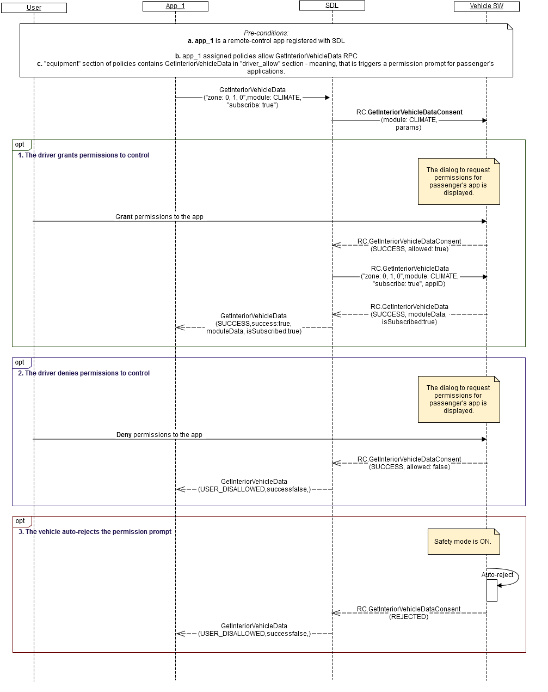

## RC.GetInteriorVehicleDataConsent
Type
:	Function

Sender
:	SDL

Purpose
:	Obtain driver's permission for the passenger's application to control the specified module in the specified zone.

_**Trigger to send:**_    
RSDL sends _RC.GetInteriorVehicleDataConsent_ to the vehicle after receiving a valid remote-control request from passenger's application that requires driver's approval.   
 
_**Error handling:**_  

1.	RSDL validates response from the vehicle and in case it's invalid, RSDL returns GENERIC_ERROR result to the corresponding mobile application's request.   
Validation includes:    
 - Mandatory parameters to be present;   
 - Type of parameters values to correspond HMI_API;    
 - Parameters values to be in bounds with HMI_API;   
 - JSON format to be valid.   
 
2. RSDL waits for response from the vehicle during RSDL's internal timeout for vehicle RPCs (_DefaultTimeout_ parameter in _SmartDeviceLink.ini_ file; set to 10 sec by default) and in case it's not received, RSDL treats this as driver's denial.   

### Request

_**Behavior**_:   

1.	_Happy path_ (see diagram A) - the vehicle must:   
  1.1. Process the request (see example "request") in the following way:   
        a. Display the permission prompt to the driver based on parameters from request and with the possibility to either confirm or reject the prompt.   

 1.2. Form a valid JSON response (see example "response") with   
        a. "allowed: true" - in case the driver confirms the prompt (grant the permission to the specified application).   
        b. "allowed: false" - in case the driver rejects the prompt (denies the permission to the specified application).   

 1.3. Send a response during 10 sec from the time of request receipt.    
_Note:_ In case the vehicle needs to display the permission prompt longer than 10 sec, it may renew SDL's default timeout for vehicle RPCs via _BasicCommunication.OnResetTimeout_ notification.   

2.	Safety - the vehicle must:    
 2.1. Respond with REJECTED resultCode in case the _RC.GetInteriorVehicleDataConsent_   
        a. Causes driver distraction;   
        b. Comes again from the same application after driver's denial;   
        c. Comes for controlling the module already busy with another passenger's application.   
        _Information: The vehicle is expected to allow only one passenger's application and one driver's application to control the same module at the same time._   
3.	 Other result codes - the vehicle may:   
 3.1. Implement additional checks and return the resultCodes described in "applicable result codes" table of Response.   

#### Parameters

|    Param Name    |    Type                   |    Mandatory    |    Description                                                           |
|------------------|---------------------------|-----------------|--------------------------------------------------------------------------|
|    moduleType    |    Common.ModuleType      |    true         |    The module that the app requests to   control                         |
|    zone          |    Common.InteriorZone    |    true         |    The zone in which the app requests to   control                       |
|    appID         |    Integer                |    true         |    Internal SDL-assigned Id of the   application related to this RPC.    |


### Response

_**Behavior**_:   
The below table lists resultCodes that the vehicle may use to respond:

|Result|Description|Message type-WebSocket|Message type - D-Bus|Message Params|Notes|
|:------|:---------|:---------------------|:-------------------|:-------------|:----|
|Success|SUCCESS The vehicle successfully processes the request:<br>Provides the data for the requested module in the requested location<br>Subscribes or unsubscribes the application from notifications if requested.|JSON response|Regular response|allowed, code: 0|See example "response".|
|Failure|UNSUPPORTED_RESOURCE The vehicle does not support the requested module in the requested location.|JSON error message|Regular response|code: 2|Applicable for this RPC result codes. Please see Result Enumeration for all SDL-supported codes. See example "error message".|
|Failure|REJECTED The vehicle rejects GetInteriorVehicleData request because of<br>- Other tasks of higher priority<br>- Safety rules in effect<br>- The requested module is busy with another passenger's application.|JSON error message|Regular response|code: 4|Applicable for this RPC result codes. Please see Result Enumeration for all SDL-supported codes.See example "error message".|
|Failure|GENERIC_ERROR The unknown issue occurred or other codes are not applicable.|JSON error message|Regular response|code: 22|Applicable for this RPC result codes. Please see Result Enumeration for all SDL-supported codes.See example "error message".|

#### Parameters

|    Param Name    |    Type       |    Mandatory    |    Description                                                                                                                                                                  |
|------------------|---------------|-----------------|---------------------------------------------------------------------------------------------------------------------------------------------------------------------------------|
|    allowed       |    Boolean    |    true         |    "true" - if the driver grants the permission for controlling to the named app;<br>"false" - in case the driver denies the permission for controlling to the named app.    |

### Sequence Diagrams 

A. GetInteriorVehicleDataConsent - vehcile response cases
 


### Example Request

```json
{
     "id" : 76,
     "jsonrpc" : "2.0",
     "method" : "RC.GetInteriorVehicleDataConsent",
     “params” :
     {             
      "moduleZone" :
      {
                 "col" : 0,
                 "row" : 1,
                 "level" : 0,
                 "colspan" : 2,
                 "rowspan" : 2,
                 "levelspan" : 0   
      },
      "moduleType" : "CLIMATE",
      "appID" : 65128
     }
}
```

### Example Response

```json
{
     "id" : 76,
     "jsonrpc" : "2.0",
     "result" :
     {
            "allowed" : true
     },
      "code" : 0,
      "method" : "RC.GetInteriorVehicleDataConsent"
     }
}
```

### Example Error
```json
{
     "id" : 76,
     "jsonrpc" : "2.0",
     "error" :
     {
      "code" : 4,
      "message" : "The request is rejected because the module is busy",
      "data" :
      {
                 "method" : "RC.GetInteriorVehicleDataConsent"
      }
     }
}
```


