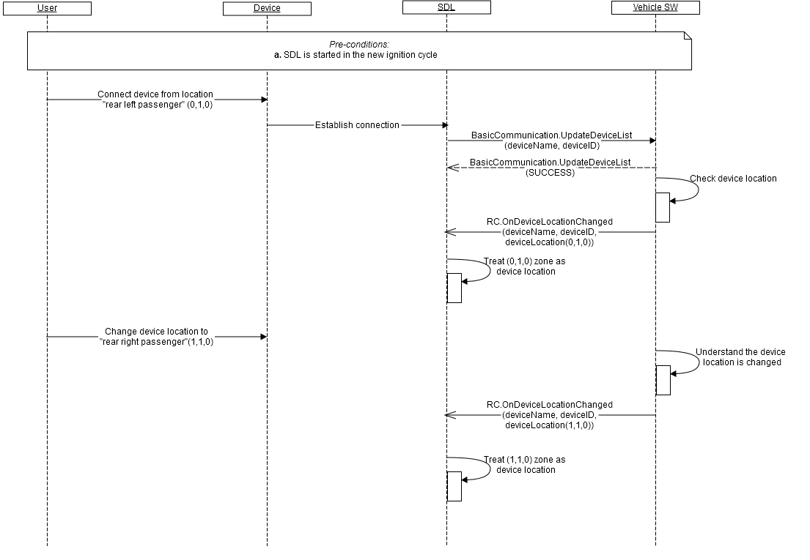

## RC.OnDeviceLocationChanged		
Type		
:	Notification		
	
Sender		
:	Vehicle		
		
Purpose		
:	Notify the connected device's location is changed.
		
_**Error handling:**_   		
1.	RSDL validates notification from the vehicle and in case it's invalid, RSDL discards it (does not apply in its internal logic).   
Validation includes:   
 - Mandatory parameters to be present;   
 - Type of parameters values to correspond HMI_API;   
 - Parameters values to be in bounds with HMI_API;   
 - JSON format to be valid.
		
		
_**Defaults:**_   		
		1.	By default (until _OnDeviceLocationChanged_() is received from the vehicle) RSDL treats the location provided by the application via one of remote-control RPCs as device location.   
		
_**Usage:**_:   		
By RC.OnDeviceLocationChanged notification from the vehicle, RSDL:   
1.	Starts checking the "permission prompt triggers" for the applications from the named passenger's device against the location from notification (See also RC.GetInteriorVehicleDataConsent);   
2.	Resets application's subscription status (unsubscribes in case the related application(s) was subscribed. See [RC.GetInteriorVehicleData](./RC/RC.GetInteriorVehicleData/index.md).   		
		
_**Behavior**_:   
1.	The vehicle must (see  diagram A):   
 1.1. Implement the mechanism to define the mobile device's location in the vehicle interior.   
 1.2. Form a valid JSON notification with parameters values that correspond the device location (see "parameters" below and  example "notification") in case:   
        - the vehicle receives UpdateDeviceList with name and id of connected device;   
        - the location of the known (via UpdateDeviceList) device is changed.   
 1.3. Send the notification to RSDL.   


#### Parameters		
		
|    Param Name        |    Type                   |    Mandatory    |    Description                                                                                                                                                            |
|----------------------|---------------------------|-----------------|---------------------------------------------------------------------------------------------------------------------------------------------------------------------------|
|    deviceLocation    |    Common.InteriorZone    |    true         |    If the value is "DRIVER" - the named by DeviceInfo device is set as driver's.<br>If the value is "PASSENGER" - the named by DeviceInfo device is set as passenger's.   |
|    device            |    Common.DeviceInfo      |    true         |    The   device info. Initially is sent by SDL via UpdateDeviceList to the vehicle. Only name and id must be provided.                                                    |
    
	
### Sequence Diagrams   		
		
A. OnDeviceRankChanged upon vehicle settings and upon driver's command   		
  		

### Example Notification		
		
```json		
 {
     "jsonrpc" : "2.0",
     "method" : "RC.OnDeviceRankChanged",
     “params” :
     {
            "deviceLocation" :
            {
                   "col" : 0,
                   "row" : 1,
                   "level" : 0,
                   "colspan" : 2,
                   "rowspan" : 2,
                   "levelspan" : 0   
            },
            "device" :
            {
                   "name" : "Paul's phone",
                   "id" : 123456
            }
     }
}
```		

