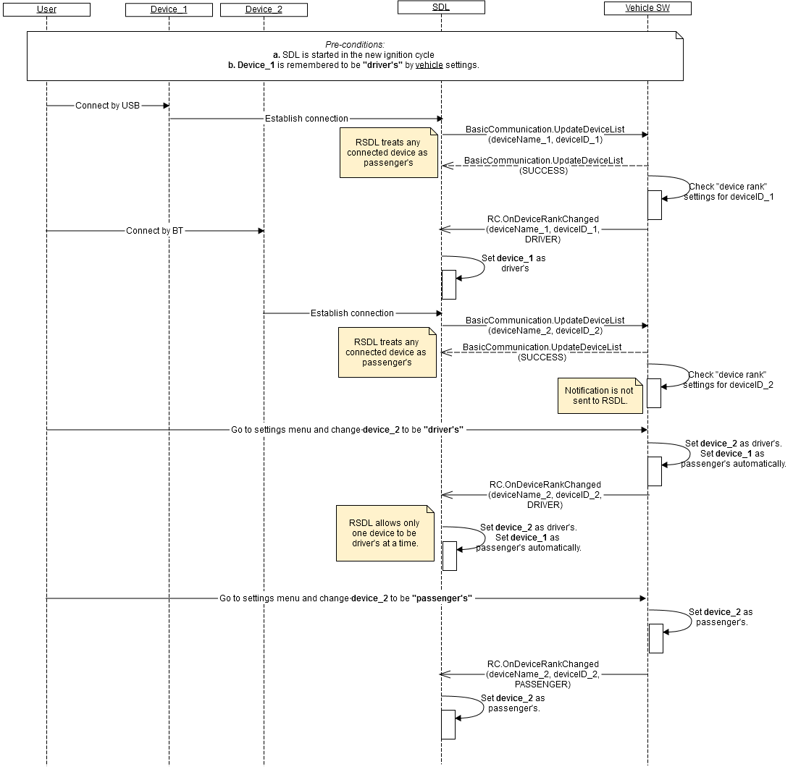

## RC.OnDeviceRankChanged
Type
:	Notification

Sender
:	Vehicle

Purpose
:	Notify the connected device's rank is changed to either driver's or passenger's.

_**Error handling:**_   
1. RSDL validates notification from the vehicle and in case it's invalid, RSDL discards it (does not apply in its internal logic).   
_Validation includes:_   
  - Mandatory parameters to be present;   
  - Type of parameters values to correspond HMI_API;   
  - JSON format to be valid.   

_**Defaults:**_   
1.	By default (until _OnDeviceRankChanged_(DRIVER) is received from the vehicle) RSDL treats any connected device as passenger's.   
2.	RSDL does not store device rank notified via _OnDeviceRankChanged_ through ignition cycles (meaning, the device ranked as "driver's" in the previous ignition cycle will be defaulted to "passenger's" in the next ignition cycle by RSDL).   
3.	RSDL allows only one device to be "driver's" at a time (meaning, current "driver's" device will start to be treated as passenger's by RSDL in case the vehicle sends _OnDeviceRankChanged_(DRIVER) for another device).   


_**Usage:**_   
By _RC.OnDeviceRank_ notification from the vehicle, RSDL:   
1.	Re-assigns policies to the related applications:   
-> the same application will get different set of permissions depending on whether the related device is ranked as "driver's" or as "passenger's";   
2.	Sends _OnHMIStatus_("deviceRank") notification to the related applications;   
3.	Resets application's subscription status (unsubscribes in case the related application(s) was subscribed. See [RC.GetInteriorVehicleData](./RC/RC.GetInteriorVehicleData/index.md).   

_**Behavior**_:   
1.	The vehicle must (see diagram A):   
 1.1. Implement the command that allows the driver to rank a device to either "driver's" or "passenger's" through the Settings Menu (UI or VR or both).    
 1.2. Form a valid JSON notification with parameters values that corresponds driver's choice (see "parameters" below and  example "notification") in case:   
        - the above command is recognized   
        - the vehicle receives _UpdateDeviceList_ with name and id of the device that is stored to be "driver's" per earlier choice.   
 1.3. Send the notification to RSDL.   
2.	The vehicle may:   
 2.1. Avoid sending notification - in case the device rank of connected device is remembered as passenger's by the vehicle settings.   


#### Parameters

|    Param Name    |    Type       |    Mandatory    |    Description                                                                                        |
|------------------|---------------|-----------------|-------------------------------------------------------------------------------------------------------|
|    allowed       |    Boolean    |    true         |    If "true" - remote-control for passenger's applications is allowed.<br>If "false" - disallowed.    |


### Sequence Diagrams   

A. A. OnDeviceRankChanged upon vehicle settings and upon driver's command   
  

### Example Notification

```json
{
     "jsonrpc" : "2.0",
     "method" : "RC.OnDeviceRankChanged",
     “params” :
     {
            "deviceRank" : "DRIVER",
            "device" :
            {
                   "name" : "Paul's phone",
                   "id" : 123456
            }
     }
}
```
