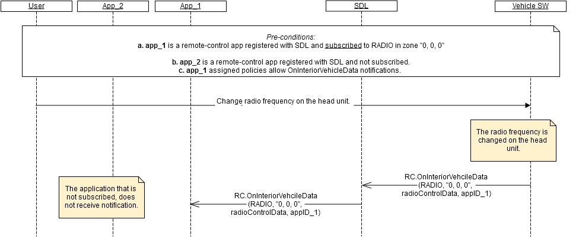

## RC.OnInteriorVehicleData
Type
:	Function

Sender
:	Vehicle

Purpose
:	Notify the application subscribed to the specified module in the specified location about the data change.

_**Error handling:**_   
1.	RSDL validates notification from the vehicle and in case it's invalid, RSDL discards it (not transfer it to the specified mobile application).   
_Validation includes_:    
 - Mandatory parameters to be present;
 - Type of parameters values to correspond HMI_API;
 - Parameters values to be in bounds with HMI_API;
 - JSON format to be valid;
 - Module and ControlData to match (_for example, notification with "RadioControlData" sent together with CLIMATE moduleType is invalid_).   


_**Behavior**_:   
1.	The vehicle must (see diagram A):   
  1.1. Monitor the data change of the module in the location that was subscribed by the application (see [RC.GetInteriorVehicleData](./RC/RC.GetInteriorVehicleData/index.md) for details about subscription);   
  1.2. Form a valid JSON notification with the changed data put as parameters values and with the appID of the subscribed application (see "parameters" below and example "notification");   
  1.3. Send the notification to RSDL.   
_Information:   
a. The vehicle is expected to send OnInteriorVehicleData notifications only in case there is at least one application currently subscribed via RC.GetInteriorVehcileData._

#### Parameters

|    Param Name    |    Type                 |    Mandatory    |    Description                                                         |
|------------------|-------------------------|-----------------|------------------------------------------------------------------------|
|    moduleData    |    Common.ModuleData    |    true         |    Data changed in the specified module in   the specified location    |


### Sequence Diagrams   

A. OnInteriorVehicleData notification is sent upon data change   
  

### Example Notification

```json
{
     "jsonrpc" : "2.0",
     "method" : "RC.OnInteriorVehicleData",
     “params” :
     {
            "moduleData" :
            {
                    "moduleType" : "RADIO",
                    "moduleZone" :
                    {               
                            "col" : 0,
                            "row" : 0,
                            "level" : 0,
                            "colspan" : 2,
                            "rowspan" : 2,
                            "levelspan" : 0
                    },
                    "radioControlData" : 
                    {  
                            "frequencyInteger" : 105,
                            "frequencyFraction" : 3
                    }  
            },
            "appID" : 65128
      }
     }
```
