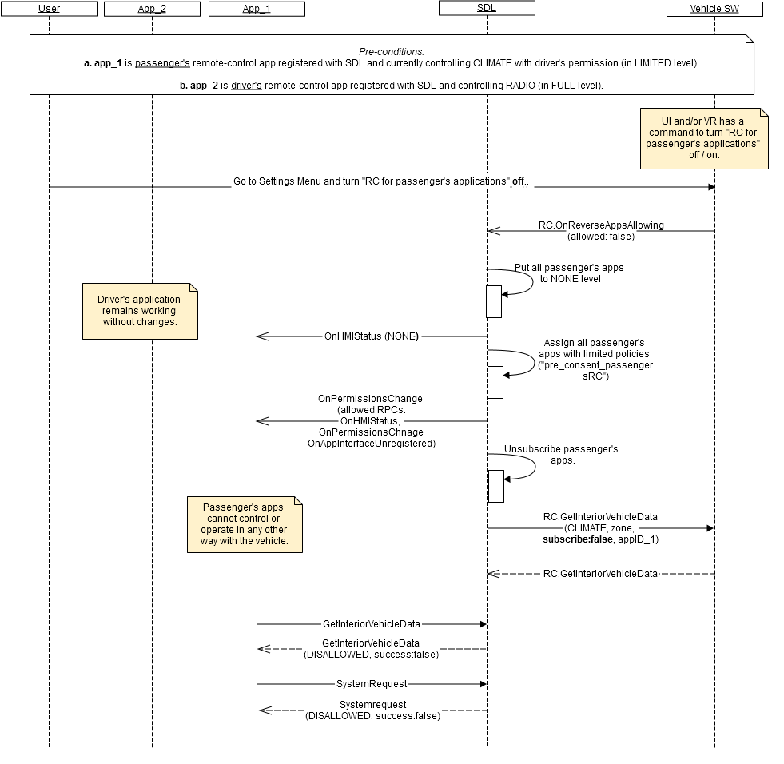

## RC.OnReverseAppsAllowing

Type
:	Notification

Sender
:	Vehicle

Purpose
:	Notify the remote-control for passenger's applications is either turned off or on.

_**Error handling:**_   
1.	RSDL validates notification from the vehicle and in case it's invalid, RSDL discards it (does not apply in its internal logic).
_Validation includes:_   
    - Mandatory parameters to be present   
    - Type of parameters values to correspond HMI_API   
    - JSON format to be valid.   

_**Defaults:**_   
1.	By default (until _OnReverseAppsAllowing_(false) is received from the vehicle) RSDL allows RC for passenger's applications.
2.	RSDL stores driver's settings notified via _OnReverseAppsAllowing_ through ignition cycles.

_**Usage:**_   
By _RC.OnReverseAppsAllowing_ notification from the vehicle, RSDL:   
1.	Re-assigns policies to the passenger's application(s):   
 1.a. the very limited set of permissions is assigned (that allow notifications from RSDL only) in case the parameter value is "false";   
 1.b. normal set of permissions (obtained from the cloud) is assigned in case the parameter value is "true".   
2.	Resets passenger's application(s) subscription status (unsubscribes in case the related application(s) was subscribed. See [RC.GetInteriorVehicleData](./RC/RC.GetInteriorVehicleData/index.md) in case the parameter value is "false".   

_**Behavior**_:   
1.	The vehicle must (see diagram A):   
 1.1. Implement the _command_ that allows the driver to either turn off or turn on the Remote-Control for passenger's applications through the Settings Menu (UI or VR or both);   
 1.2. After the above command is recognized, form a valid JSON notification with parameter value that corresponds driver's choice (see "parameters" below and  example "notification");   
 1.3. Send the notification to RSDL.


#### Parameters

|    Param Name    |    Type       |    Mandatory    |    Description                                                                                         |
|------------------|---------------|-----------------|--------------------------------------------------------------------------------------------------------|
|    allowed       |    Boolean    |    true         |    If "true" -   remote-control for passenger's applications is allowed. If "false"   - disallowed.    |


### Sequence Diagrams   

A. Disable remote-control for passenger's applications   
  

### Example Notification

```json
{
     "jsonrpc" : "2.0",
     "method" : "RC.OnReverseAppsAllowing",
     “params” :
     {
            "allowed" : false
     }
}
```

