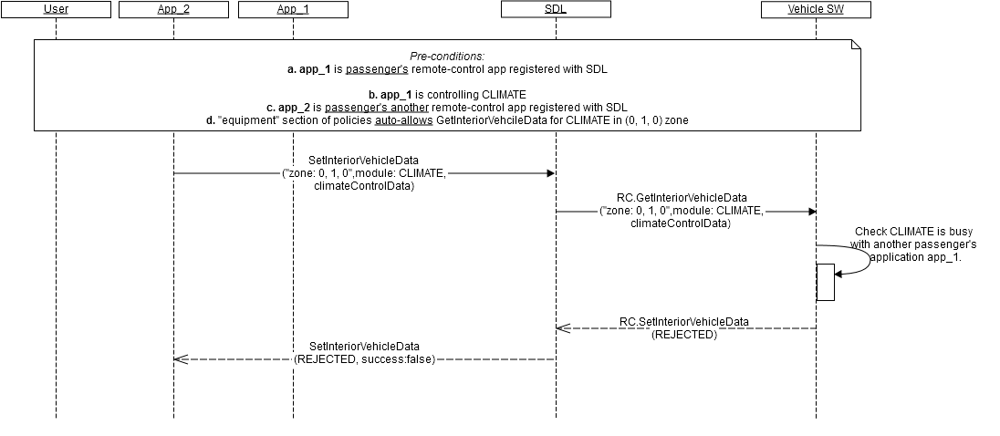

## RC.SetInteriorVehicleData
Type
:	Function

Sender
:	SDL

Purpose
:	Control the specified module in the specified location

_**Trigger to send:**_   
RSDL sends _RC.SetInteriorVehicleData_ to the vehicle after receiving a valid _SetInteriorVehicleData_ request from remote-control application.   

_**Error handling:**_   

1.	RSDL validates response from the vehicle and in case it's invalid, RSDL returns GENERIC_ERROR result to the corresponding mobile application's request.
Validation includes:   
   - Mandatory parameters to be present;   
   - Type of parameters values to correspond HMI_API;   
   - Parameters values to be in bounds with HMI_API;   
   - JSON format to be valid;   
   - Module and ControlData to match (for example, response with "RadioControlData" sent together with CLIMATE moduleType is invalid).   

2. RSDL waits for response from the vehicle during RSDL's internal timeout for vehicle RPCs (_DefaultTimeout_ parameter in _SmartDeviceLink.ini_ file; set to 10 sec by default) and in case it's not received, RSDL returns GENERIC_ERROR result to the corresponding mobile application's request.   

_**"Read only" validation:**_    
RSDL validates the _SetInteriorVehicleData_ request from remote-control application with the purpose to filter (never send to the vehicle) the read-only parameters, which are the following:   

1. RADIO module read-only parameters:   
  - "rdsData" 
  - "availableHDs" 
  - "signalStrength" 
  - "signalChangeThreshold" 
  - "state" 
  - "radioEnable" 
2. CLIMATE mudule read-only parameters:   
  - "currentTemp"
3. SEAT module read-only parameters:   
 - "cooledSeats" 
 - "heatedSeat" 
 - "massageEnabled"

### Request

_**Behavior**_:   

1.	_Happy path_ (see diagram A) - the vehicle must:   
 1.1. Process the request in the following way:   
        a. Set the data to the requested module in the requested location (see "parameters" of Request and example "request").   
        b. Read the data (with the purpose to know whether the requested data is successfully set) from the requested module in the requested location.   
 1.2. Form a valid JSON response with   
        a. Retrieved data put as parameters values (see "parameters" of Response).   
 1.3. Send a response during 10 sec from the time of request receipt.   
 
2.	Module is busy (see diagram B and example "error message") - the vehicle must:   
 2.1. Respond with REJECTED resultCode in case the request is from passenger's application and another passenger's application is currently controlling the same module (no matter in what location).    
        _Information_: The vehicle is expected to allow only one passenger's application and one driver's application to control the same module at the same time.     
3.	 _Other result_ codes - the vehicle may:   
 3.1. Implement additional checks and return the resultCodes described in "applicable result codes" table of Response.   

#### Parameters

|Param Name|Type|Mandatory|Description|
|:---------|:---|:--------|:----------|
|moduleData|Common.ModuleData|true|Data to be set for the specified module in the specified location|
|appID|Integer|true|Internal SDL-assigned Id of the application related to this RPC.|

### Response

_**Behavior**_:   
The below table lists resultCodes that the vehicle may use to respond: 

|Result|Description|Message type-WebSocket|Message type - D-Bus|Message Params|Notes|
|:------|:---------|:---------------------|:-------------------|:-------------|:----|
|Success|SUCCESS The vehicle successfully processes the request: Sets the data for the requested module in the requested location|JSON response|Regular response|moduleData, code: 0|See example "response".|
|Failure|UNSUPPORTED_RESOURCE The vehicle does not support the requested module in the requested location.|JSON error message|Regular response|code: 2|Applicable for this RPC result codes. Please see Result Enumeration for all SDL-supported codes. See example "error message".|
|Failure|REJECTED The vehicle rejects GetInteriorVehicleData request because of:<br>Other tasks of higher priority<br>The requested module is busy with another passenger's application.|JSON error message|Regular response|code: 4|Applicable for this RPC result codes. Please see Result Enumeration for all SDL-supported codes. See example "error message".|
|Failure|IGNORED The vehicle ignores the request because the requested data to be set are the same as in the previous request.|JSON error message|Regular response|code: 6|Applicable for this RPC result codes. Please see Result Enumeration for all SDL-supported codes. See example "error message".|
|Failure|GENERIC_ERROR The unknown issue occurred or other codes are not applicable.|JSON error message|Regular response|code: 22|Applicable for this RPC result codes. Please see Result Enumeration for all SDL-supported codes. See example "error message".|
|Failure|READ_ONLY The vehicle has all of requested parameters as "read-only" ones for the requested module in the requested location.|JSON error message|Regular response|code: 25|Applicable for this RPC result codes. Please see Result Enumeration for all SDL-supported codes. See example "error message".|

#### Parameters
|Param Name|Type|Mandatory|Description|
|:---------|:---|:--------|:----------|
|moduleData|Common.ModuleData|true|The data from the requested module in the requested location.|

### Sequence Diagrams   
A. RSDL transfers vehcile's successful response to the mobile application   


B. The vehcile rejects the request from another passenger's application for the busy module 


### Example Request 

```json
{
     "id" : 70,
     "jsonrpc" : "2.0",
     "method" : "RC.SetInteriorVehicleData",
     “params” :
     {
            "moduleData" :
            {
                    "moduleType" : "CLIMATE",
                    "moduleZone" :
                    {               
                            "col" : 0,
                            "row" : 1,
                            "level" : 0,
                            "colspan" : 2,
                            "rowspan" : 2,
                            "levelspan" : 0
                    },
                    "climateControlData" : 
                    {  
                            "desiredTemp" : 20,
                            "temperatureUnit" : “CELSIUS”
                    }  
            },
            "appID" : 65128
      }
```

### Example Response

```json
{
     "id" : 70,
     "jsonrpc" : "2.0",
     "result" :
     {
            "moduleData" :
            {
                    "moduleType" : "CLIMATE",
                    "moduleZone" :
                    {               
                            "col" : 0,
                            "row" : 1,
                            "level" : 0,
                            "colspan" : 2,
                            "rowspan" : 2,
                            "levelspan" : 0
                    },
                    "climateControlData" : 
                    {  
                            "fanSpeed" : 40,
                            "currentTemp" : 20,
                            "temperatureUnit" : “CELSIUS”,
                            "acEnable" : true
                    }  
            },
      "code" : 0,
```

### Example Error
```json
{
     "id" : 70,
     "jsonrpc" : "2.0",
     "error" :
     {
      "code" : 4,
      "message" : "The request is rejected because the module is busy",
      "data" :
      {
                 "method" : "RC.SetInteriorVehicleData"
      }
     }
}
```


