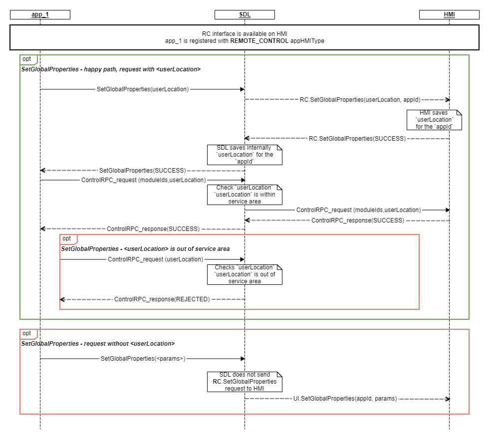

## SetGlobalProperties

Type
: Function

Sender
: SDL

Purpose
: Inform HMI of user location properties set by the application for RC modules allocation purposes

### Description
SDL requests to set the value of user location sent by a RC application. The default `userLocation` should be `DRIVER`.  
The driver's application should be able to control any free module that is allowed by policies(even if the driver's seat is outside the service area of a module).

### Request
#### Behavior

!!! MUST   

1. Store the userLocation and associate it with appID.

!!!

#### Parameters
|Name|Type|Mandatory|Additional|
|:---|:---|:--------|:---------|
|userLocation|[Common.SeatLocation](../../common/structs/#seatlocation)|false||
|appID|Integer|true||


### Response

#### Parameters
This RPC has no additional parameter requirements

### Sequence Diagrams

|||
SetGlobalProperties

|||

### JSON Message Examples

#### Example Request

```json
{
  "id":22,
  "jsonrpc":"2.0",
  "method":"RC.SetGlobalProperties",
  "params":{
     "appID":600980185,
     "userLocation":{
        "grid":{
           "col":2,
           "colspan":1,
           "level":0,
           "levelspan":1,
           "row":0,
           "rowspan":1
        }
     }
  }
}
```

#### Example Response

```json
{
  "id" : 22,
  "jsonrpc" : "2.0",
  "result" :
  {
    "code" : 0,
    "method" : "RC.SetGlobalProperties"
  }
}
```

#### Example Error

```json
{
  "id" : 22,
  "jsonrpc" : "2.0",
  "error" :
  {
    "code" : 22,
    "message" : "During API call the unknown error has occurred",
    "data" :
    {
      "method" : "RC.SetGlobalProperties"
    }
  }
}
```
