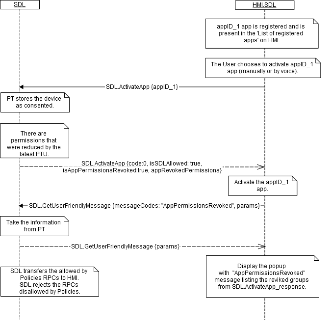
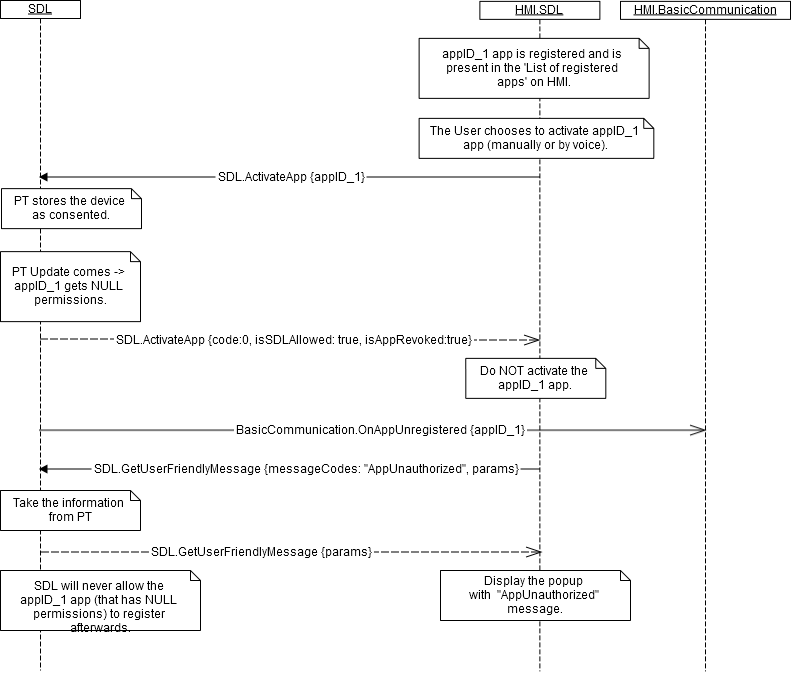
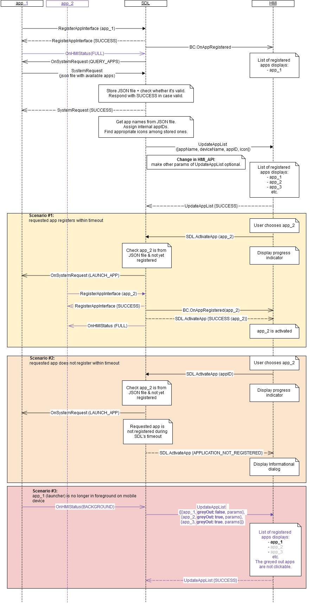

## ActivateApp

Type
: Function

Sender
: HMI

Purpose
: Inform SDL that the user has activated an application.

### Request

!!! MUST
1. Send `SDL.ActivateApp`.  
2. Send a request to SDL to get messages for specified permissions (via `GetUserFriendlyMessage`) and notify user that provided permissions of application were decreased in case HMI gets  "isAppPermissionRevoked:true" respond from SDL PoliciesManager.  
3. Send `GetListOfPermissions` request to SDL in order to obtain list of message codes for functional groups needed by application for user to consent when PoliciesManager responds with "isPermissionsConsentNeeded: true" .  
4. Display Dialog and on result of user selection to send `OnAllowSDLFuncionality` specifying device from `ActivateApp` response, source of choice (UI/VR) and allowed set to true/false (if user ignores question, this is automatically set to false) when HMI receives `SDL.ActivateApp` (isSDLAllowed: false).
!!!

#### Parameters

|Name|Type|Mandatory|Additional|
|:---|:---|:--------|:---------|
|appID|Integer|true||

### Response

#### Parameters

|Name|Type|Mandatory|Additional|
|:---|:---|:--------|:---------|
|isSDLAllowed|Boolean|true||
|device|[Common.DeviceInfo]|false||
|isPermissionsConsentNeeded|Boolean|true||
|isAppPermissionsRevoked|Boolean|true||
|appRevokedPermissions|[Common.PermissionItem]|false|array: true<br>minsize: 1<br>maxsize: 100|
|isAppRevoked|Boolean|true||
|priority|[Common.AppPriority]|false||

[Common.DeviceInfo]: ../../common/structs/#deviceinfo

[Common.PermissionItem]: ../../common/structs/#permissionitem

[Common.AppPriority]: ../../common/enums/#apppriority

### Sequence Diagrams

Preconditions:   
a. Device is connected to the HU.   
b. App_1 is running on this device and is registered with SDL.   
c. App_1 presents in the list of registered apps on HMI.

|||
The User does NOT consent the device.

|||

|||
The User consents the device.

|||

|||
ActivateApp for application registered with reduced permissions after Policy Table Update

|||
|||
ActivateApp for application registered with revoked permissions after Policy Table Update

|||
|||
ActivateApp using App Launching

|||

### Example Request

```json
{
  "id" : 27,
  "jsonrpc" : "2.0",
  "method" : "SDL.ActivateApp"
  "params" :
  {
    "appID" : 12345
  }
}
```
### Example Response

```json
{
  "id" : 27,
  "jsonrpc" : "2.0",
  "result" :
  {
    "isSDLAllowed" : true,
    "isPermissionsConsentNeeded" : false,
    "isAppPermissionsRevoked" : false,
    "isAppRevoked" : false,
    "code" : 0,
    "method" : "SDL.ActivateApp"
  }
}
```

### Example Error

```json
{
  "id" : 27,
  "jsonrpc" : "2.0",
  "error" :
  {
    "code" : 22,
    "message" : "The unknown error has occurred",
    "data" :
    {
      "method" : "SDL.ActivateApp"
    }
  }
}
```
