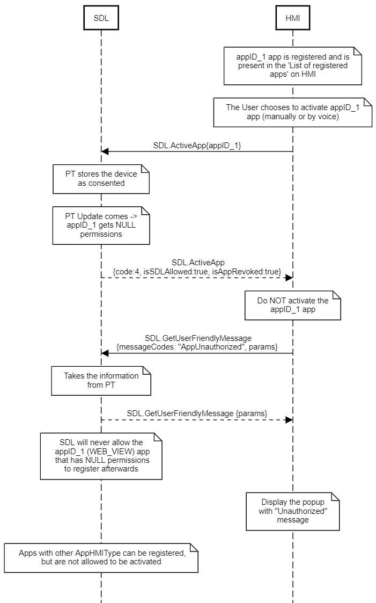

## ActivateApp


### Request

#### Parameters

|Name|Type|Mandatory|Additional|Description|
|:---|:---|:--------|:---------|:----------|
|appID|Integer|true|||

### Response

#### Parameters

|Name|Type|Mandatory|Additional|Description|
|:---|:---|:--------|:---------|:----------|
|isSDLAllowed|Boolean|true|||
|device|Common.DeviceInfo|false|||
|isPermissionsConsentNeeded|Boolean|true|||
|isAppPermissionsRevoked|Boolean|true|||
|appRevokedPermissions|Common.PermissionItem|false|array: true<br>minsize: 1<br>maxsize: 100||
|isAppRevoked|Boolean|true|||
|priority|Common.AppPriority|false|||

#### DeviceInfo

|Name|Type|Mandatory|Additional|Description|
|:---|:---|:--------|:---------|:----------|
|name|String|true|||
|id|String|true|||
|transportType|Common.TransportType|false|||
|isSDLAllowed|Boolean|false|||

#### PermissionItem

|Name|Type|Mandatory|Additional|Description|
|:---|:---|:--------|:---------|:----------|
|name|String|true|||
|id|Integer|true|||
|allowed|Boolean|false|||

#### AppPriority

|Name|Value|
|:---|:----|
|EMERGENCY|0|
|NAVIGATION|1|
|VOICE_COMMUNICATION|2|
|COMMUNICATION|3|
|NORMAL|4|
|NONE|5|

### Sequence Diagrams
|||
ActivateApp for application registered with reduced permissions after Policy Table Update

|||
|||
ActivateApp for application registered with revoked permissions after Policy Table Update

|||
|||
ActivateApp using App Launching

|||

### Example Request

```json
{
	"id" : 27,
	"jsonrpc" : "2.0",
	"method" : "SDL.ActivateApp"
	"params" :
	{
		"appID" : 12345
	}
}
```
### Example Response

```json
{
	"id" : 27,
	"jsonrpc" : "2.0",
	"result" :
	{
		"isSDLAllowed" : true,
		"isPermissionsConsentNeeded" : false,
		"isAppPermissionsRevoked" : false,
		"isAppRevoked" : false,
		"code" : 0,
		"method" : "SDL.ActivateApp"
	}
}
```

### Example Error

```json
{
	"id" : 27,
	"jsonrpc" : "2.0",
	"error" :
	{
		"code" : 22,
		"message" : "The unknown error has occurred",
		"data" :
		{
			"method" : "SDL.ActivateApp"
		}
	}
}
```
