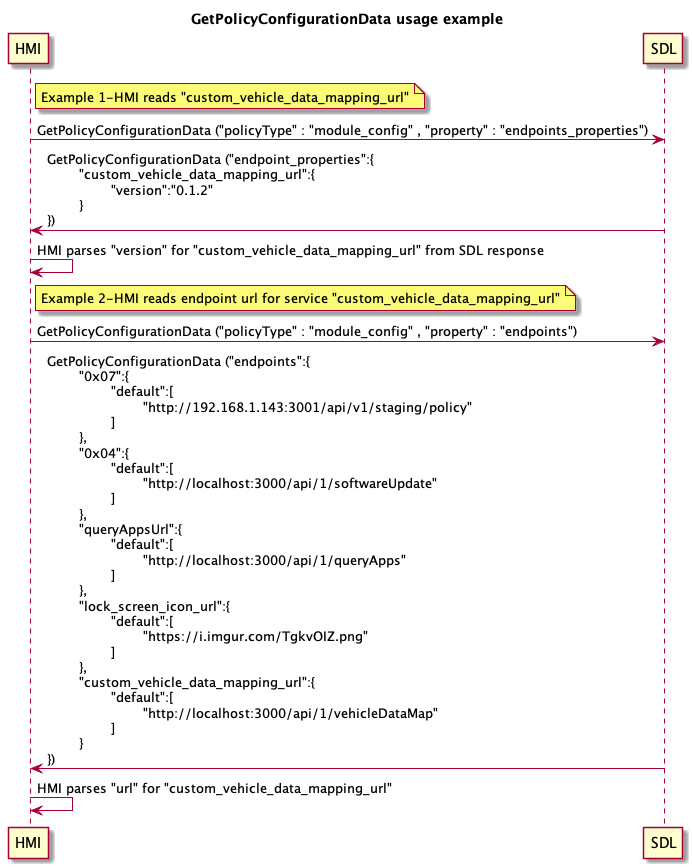

## GetPolicyConfigurationData

Type
: Function

Sender
: HMI

Purpose
: To get policy type and property


### Request

!!! MUST
 
1. Send GetPolicyConfigurationData request to SDL with: 
* `policyType` : Policy Struct for which property needs to be read. Must be a [valid policyType struct](https://github.com/smartdevicelink/sdl_core/blob/master/src/components/policy/policy_regular/include/policy/policy_table/types.h#L288)
* `property`: used to pin point exact property of policyType, if omitted, entire policyType json is returned

!!!


#### Parameters

|Name|Type|Mandatory|Additional|
|:---|:---|:--------|:---------|
|policyType|String|true|minlength: 1 maxlength: 1000|
|property|String|true|minlength: 1 maxlength: 1000|

### Response

#### Parameters

|Name|Type|Mandatory|Additional|
|:---|:---|:--------|:---------|
|value|String|true|array: true <br> maxlength: 1000 minsize: 1 maxsize: 100|
 

### Sequence Diagrams

|||
GetPolicyConfigurationData 
Below is the example usage for GetPolicyConfigurationData request to read `version` and endpoint `url` for `custom_vehicle_data_mapping_url`
* HMI needs to parse the `url` / version for `custom_vehicle_data_mapping_url` from returned json 


|||

### Example Request

```json
{
	"id" : 176,
	"jsonrpc" : "2.0",
	"method" : "SDL.GetPolicyConfigurationData",
	"params" :
	{
		"policyType": "module_config",
		"property" : "endpoints_properties"
	}
}
```
### Example Response

```json
{
	"id" : 176,
	"jsonrpc" : "2.0",
	"result" :
	{
		"value" : [
			"{\"custom_vehicle_data_mapping_url\":{\"version\":\"0.0.0\"}}"
		],
	    	"code" : 0,
		"method" : "SDL.GetPolicyConfigurationData"
	}
}
```

### Example Error

```json
{
	"id" : 176,
	"jsonrpc" : "2.0",
	"error" :
	{
		"code" : 11,
		"message" : "Invalid data",
		"data" :
		{
			"method" : "SDL.GetPolicyConfigurationData"
		}
	}
}
```
