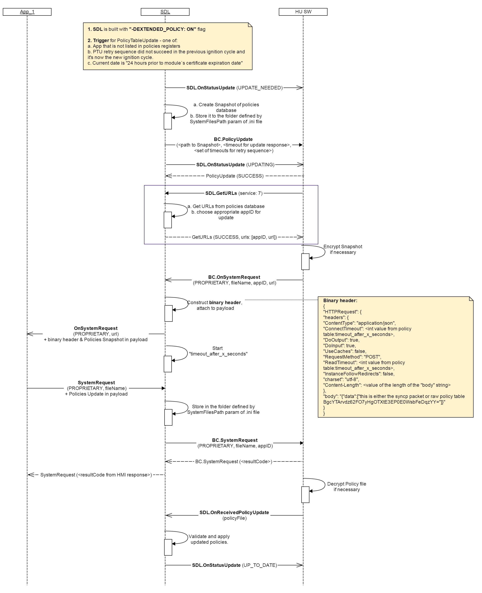

## GetURLS

Type
: Function

Sender
: HMI

Purpose
: Retrieve the destination URL(s) from Local Policy Table

### Request

!!! MUST
For Proprietary PTU flow:  
1. Send `SDL.GetURLS` after SDL-initiated [BC.PolicyUpdate](../../basiccommunication/policyupdate/policyupdate) with service type `7`
2. Use the received URL(s) in the next [BC.OnSystemRequest](../../basiccommunication/onsystemrequest/onsystemrequest).
!!!

!!! MAY
Request the URL(s) for any known service type that exists in Local PT at any time if required per internal flows.
!!!

!!! NOTE
`SDL.GetURLS` dependencies:

  * SDL sends ``BC.PolicyUpdate`` _only in case_ it's built with "-DEXTENDED_POLICY: PROPRIETARY" flag or without flag. 
  * URLs storage in Policy Table: `"endpoints"` section.
  * SDL chooses the applications for taking part in PTU among registered ones and provides `appID` + `url` pairs in response  
  * In case no applications are currently registered, SDL will return `url` only.
!!!

#### Parameters

|Name|Type|Mandatory|Additional|
|:---|:---|:--------|:---------|
|service|Integer|true|minvalue: 0<br>maxvalue: 100|

### Response

#### Parameters

|Name|Type|Mandatory|Additional|
|:---|:---|:--------|:---------|
|urls|[Common.ServiceInfo](../../common/structs/#serviceinfo)|false|array: true<br>minsize: 1<br>maxsize: 100|

### Sequence Diagrams

|||
BC.PolicyUpdate in "Proprietary" Policy Table Update Flow

|||

### Example Request

```json
{
	"id" : 176,
	"jsonrpc" : "2.0",
	"method" : "SDL.GetURLS",
	"params" :
	{
		"service" : 7
	}
}
```
### Example Response

```json
{
	"id" : 176,
	"jsonrpc" : "2.0",
	"result" :
	{
		"urls" :
		[
         {
            "url" : "https://policies.smartdevicelink.com/api/1/policies",
            "appID" : 65782
         }
		],
		"code" : 0,
		"method" : "SDL.GetURLS"
	}
}
```

### Example Error

```json
{
	"id" : 176,
	"jsonrpc" : "2.0",
	"error" :
	{
		"code" : 11,
		"message" : "Invalid data",
		"data" :
		{
			"method" : "SDL.GetURLS"
		}
	}
}
```
