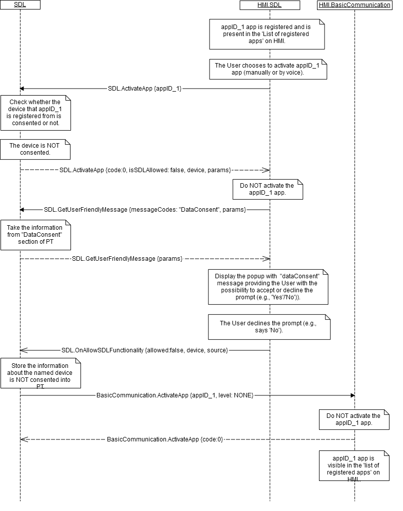

## GetUserFriendlyMessage


### Request

#### Parameters

|Name|Type|Mandatory|Additional|Description|
|:---|:---|:--------|:---------|:----------|
|messageCodes|String|true|array: true<br>minsize: 1<br>maxsize: 100<br>maxlength: 500||
|language|Common.Language|false|||

#### Language

|Name|Value|
|:---|:----|
|EN-US|0|
|ES-MX|1|
|FR-CA|2|
|DE-DE|3|
|ES-ES|4|
|EN-GB|5|
|RU-RU|6|
|TR-TR|7|
|PL-PL|8|
|FR-FR|9|
|IT-IT|10|
|SV-SE|11|
|PT-PT|12|
|NL-NL|13|
|EN-AU|14|
|ZH-CN|15|
|ZH-TW|16|
|JA-JP|17|
|AR-SA|18|
|KO-KR|19|
|PT-BR|20|
|CS-CZ|21|
|DA-DK|22|
|NO-NO|23|

### Response

#### Parameters

|Name|Type|Mandatory|Additional|Description|
|:---|:---|:--------|:---------|:----------|
|messages|Common.UserFriendlyMessage|false|array: true<br>minsize: 1<br>maxsize: 100||

#### UserFriendlyMessage

|Name|Type|Mandatory|Additional|Description|
|:---|:---|:--------|:---------|:----------|
|messageCode|String|true|||
|ttsString|String|false|||
|label|String|false|||
|line1|String|false|||
|line2|String|false|||
|textBody|String|false|||

### Sequence Diagrams
|||
GetUserFriendlyMessage for device consent

|||

### Example Request

```json

```
### Example Response

```json

```

### Example Error

```json

```
