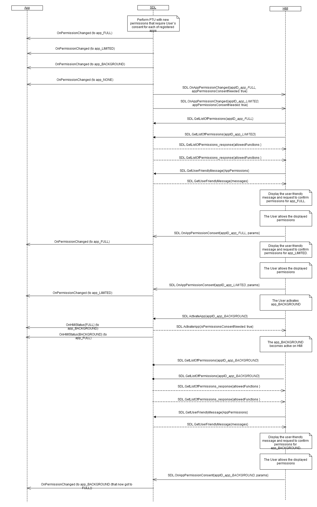

## OnAppPermissionChanged


### Notification

#### Parameters

|Name|Type|Mandatory|Additional|Description|
|:---|:---|:--------|:---------|:----------|
|appID|Integer|true|||
|isAppPermissionsRevoked|Boolean|false|||
|appRevokedPermissions|Common.PermissionItem|false|array: true<br>minsize: 1<br>maxsize: 100||
|appRevoked|Boolean|false|||
|appPermissionsConsentNeeded|Boolean|false|||
|appUnauthorized|Boolean|false|||
|priority|Common.AppPriority|false|||
|requestType|Common.RequestType|false|array: true<br>minsize: 0<br>maxsize: 100||

#### PermissionItem

|Name|Type|Mandatory|Additional|Description|
|:---|:---|:--------|:---------|:----------|
|name|String|true|||
|id|Integer|true|||
|allowed|Boolean|false|||

#### AppPriority

|Name|Value|
|:---|:----|
|EMERGENCY|0|
|NAVIGATION|1|
|VOICE_COMMUNICATION|2|
|COMMUNICATION|3|
|NORMAL|4|
|NONE|5|

#### RequestType

|Name|Value|
|:---|:----|
|HTTP|0|
|FILE_RESUME|1|
|AUTH_REQUEST|2|
|AUTH_CHALLENGE|3|
|AUTH_ACK|4|
|PROPRIETARY|5|
|QUERY_APPS|6|
|LAUNCH_APP|7|
|LOCK_SCREEN_ICON_URL|8|
|TRAFFIC_MESSAGE_CHANNEL|9|
|DRIVER_PROFILE|10|
|VOICE_SEARCH|11|
|NAVIGATION|12|
|PHONE|13|
|CLIMATE|14|
|SETTINGS|15|
|VEHICLE_DIAGNOSTICS|16|
|EMERGENCY|17|
|MEDIA|18|
|FOTA|19|

### Sequence Diagrams
|||
OnAppPermissionChanged with consent required

|||

#### JSON Example Notification
```json

```
