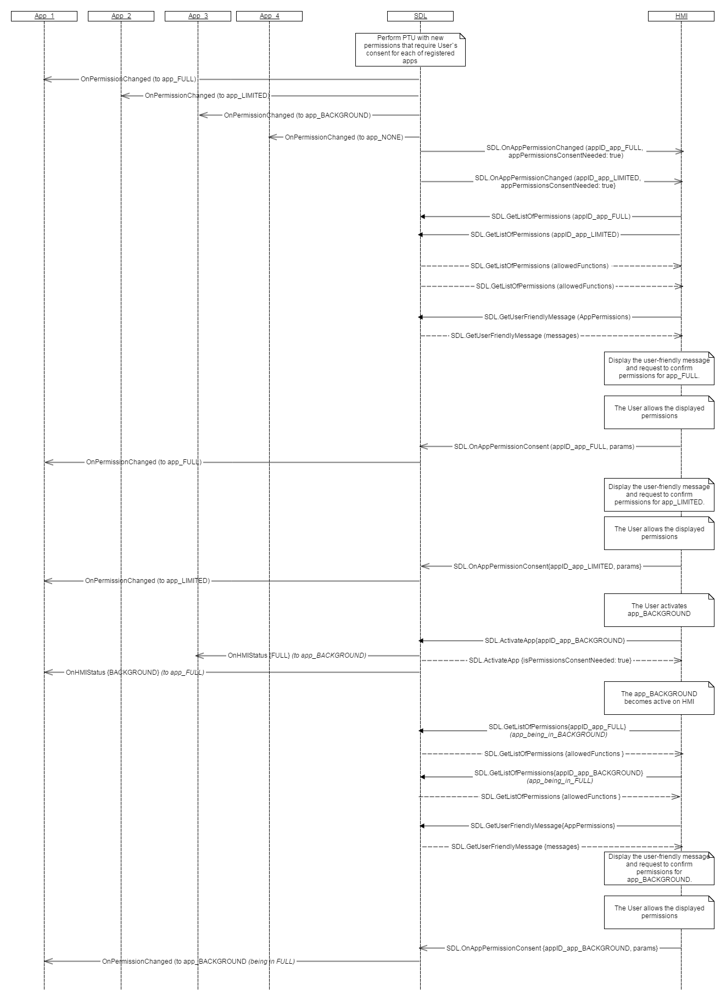
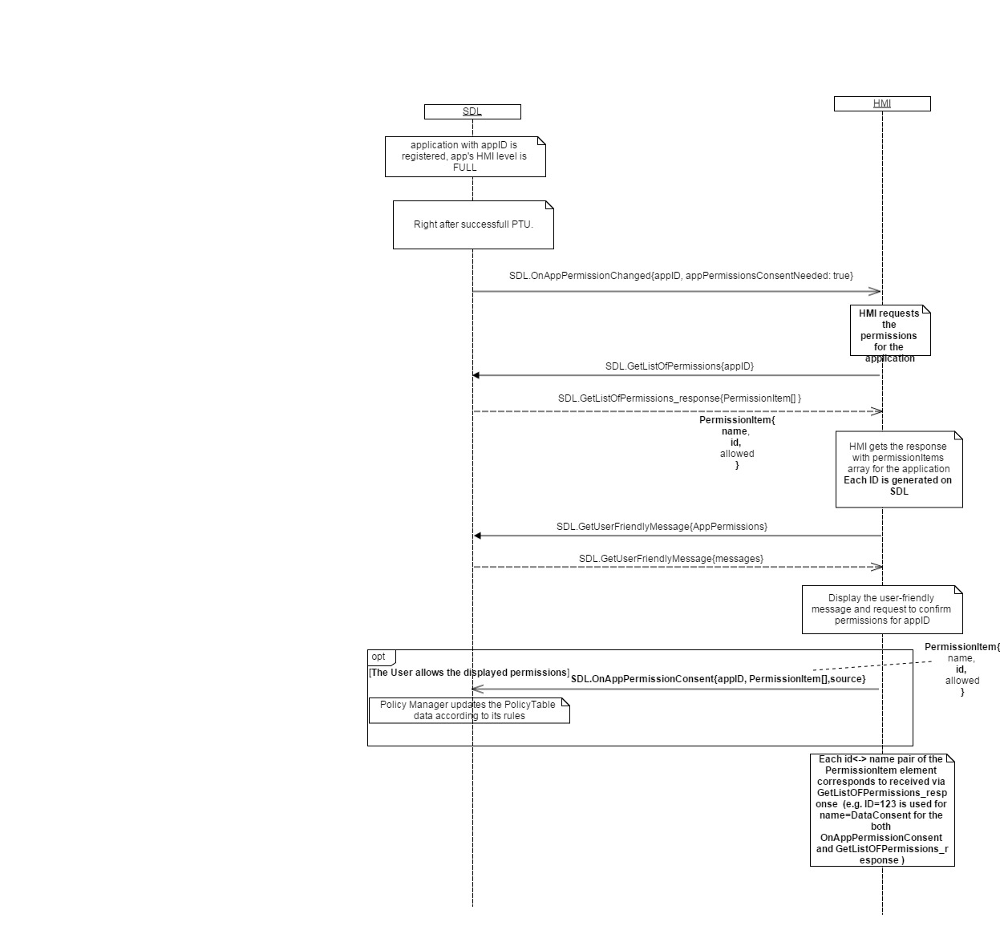

## OnAppPermissionConsent


### Notification

Type
: Notification 

Sender
: HMI  

Purpose
: Inform about the User permission changes for some functionality for the named application.

Initiated by HMI for specifying the allowance for the application to perform some functionality.The notification informs Policy Manager about some changes in application permissions, that effect application behavior on HMI.  

!!! MUST   
1) send OnAppPermissionConsent when User answers to prompt about app's permisstions consent.  
2) send OnAppPermissionConsent when User enters settings menu and allows/disallows app's permissions.  
3) use the pair of values id<->name in PermissionItem structure which were obtained via GetListOfPermissions response  
4) send OnAppPermissionConsent when User changes ExternalConsentStatus.

_SDL information:_  
PoliciesManager applies the changes to all applications in case OnAppPermissionConsent is received without `<appID>` parameter.
PoliciesManager applies the changes received via OnAppPermissionConsent according to its internal rules (update appropriate application permissions sections in the policies database etc).
!!!

!!! NOTE  
a) SDL ignores all invalid notifications which come from HMI (invalid JSON, invalid data types/bounds etc).  
b) ExternalConsentStatus either user_dissalows or user_allows applications functional groupings depending on predefined settings in policy table.  
c) SDL  uses OnAppPermissionConsent value (ON/OFF) received from HMI through ignition cycles until this value is changed by corresponding notification from HMI.
!!!

#### Parameters

|Name|Type|Mandatory|Additional|Description|
|:---|:---|:--------|:---------|:----------|
|appID|Integer|false|-|Information about the application. See [HMIApplication]. If omitted - allow/disallow all applications.|
|consentedFunctions|[Common.PermissionItem]|true|array: true<br>minsize: 1<br>maxsize: 100|-|
|ExternalConsentStatus|[Common.ExternalConsentStatus]|false|array: true <br>minsize: 1<br>maxsize: 100|-|
|source|[Common.ConsentSource]|true|-|-|

[HMIApplication]: ../../common/structs/#hmiapplication
[Common.PermissionItem]: ../../common/structs/#permissionitem
[Common.ExternalConsentStatus]: ../../common/structs/#externalconsentstatus
[Common.ConsentSource]: ../../common/enums/#consentsource

### Sequence Diagrams

Preconditions:  
a) SDL and HMI are started;   
b) Device is connected to the System (SDL/HU) and is consented by the User;   
c) Four apps are registered with SDL and HMI (_name_HMILevel_): app_FULL, app_LIMITED, app_BACKGROUND, app_NONE.

|||
User\`s consent for permissions.

|||
|||
OnAppPermissionConsent (User answers to prompt about app's permisstions consent)   

|||
|||
OnAppPermissionConsent (id<->name dependency)

|||

#### JSON Example Notification
```
{
	"jsonrpc" : "2.0",
	"method" : "SDL.OnAppPermissionConsent",
	"params" :  
	{
    "appID":13759,
    "consentedFunctions":[
     {"allowed":false,
      "id":4734356,
      "name":"DrivingCharacteristics"
     }],
    "source":"GUI"
    }}

```
