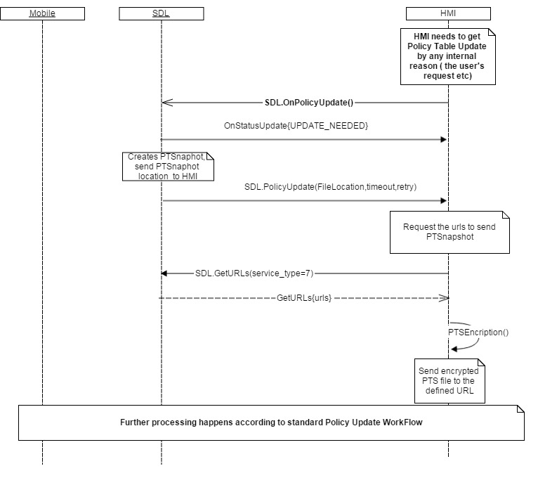

## OnPolicyUpdate
Type
: Notification

Sender
: HMI

Purpose
: Notifies SDL to supply a new "PolicyUpdate" request with more recent snapshot data

!!! MUST   
   - Send `OnPolicyUpdate` to SDL if it is required to get Policy Table Update (by any specific HMI workflow reason).
   - Continue operating according to Policies workflow in case SDL started Policy Update process as a result of [BasicCommunication.PolicyUpdate](../../basiccommunication/policyupdate/).
!!!

!!! IMPORTANT
HMI should send `SDL.OnPolicyUpdate` in case the new PT Snapshot is required from PoliciesManager. 
Currently this notification is not used in any HMI workflows, but in case of necessity, HMI may use `OnPolicyUpdate` for getting the newest Snapshot (for example, during retry sequence or by user request).
!!!

!!! NOTE
   - SDL ignores all invalid notifications which come from HMI (invalid JSON, invalid data types/bounds etc).
   - In case SDL receives `SDL.OnPolicyUpdate` notification from HMI, SDL PoliciesManager must start the procedure of Policy Table Update (that is, create PT Snapshot, send it to HMI for encryption, and etc. what is defined by related requirements).
!!!

### Notification

#### Parameters
This RPC has no additional parameter requirements.

### JSON Example Notification
```json
{
	"jsonrpc" : "2.0",
	"method" : "SDL.OnPolicyUpdate"
}
```

### Sequence Diagrams

|||
Policy Table Update flow

|||


