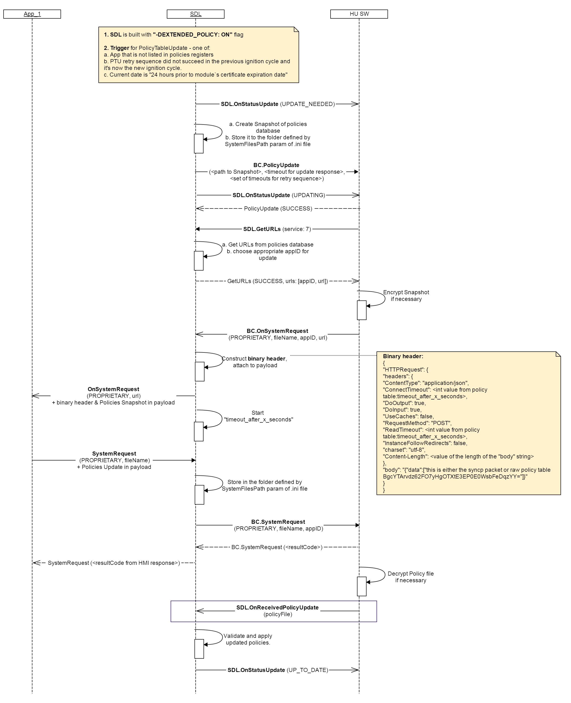

## OnReceivedPolicyUpdate
Type
: Notification

Sender
: HMI

Purpose
: Trigger SDL to merge the Updated Policy Table to the Local Policy Table

### Notification

HMI must

Send `SDL.OnReceivedPolicyUpdate` notification to SDL after HMI finalized processing the updated Policy Table delivered via `BC.SystemRequest`(for example, after decrypting it _in case_ and by the scheme required by Policies Server)

!!!

**Note**

1. `SDL.OnReceivedPolicyUpdate` dependencies:  
   * SDL expects `SDL.OnReceivedPolicyUpdate` _only in case_ it's built with "-DEXTENDED_POLICY: PROPRIETARY" flag  flag. _Otherwise_ SDL handles the entire PTU flow by itself.
   * SDL will not use Updated PT until notified by HMI

!!!

#### Parameters

|Name|Type|Mandatory|Additional|
|:---|:---|:--------|:---------|
|policyfile|String|true|minlength: 1<br>maxlength: 255|

#### JSON Example Notification
```json
{
	"id" : 176,
	"jsonrpc" : "2.0",
	"method" : "SDL.GetURLS",
	"params" :
	{
		"policyfile" : "/fs/sharedFolder/ptu.json"
	}
}
```

### Sequence Diagrams

SDL.OnReceivedPolicyUpdate in "Proprietary" Policy Table Update Flow

