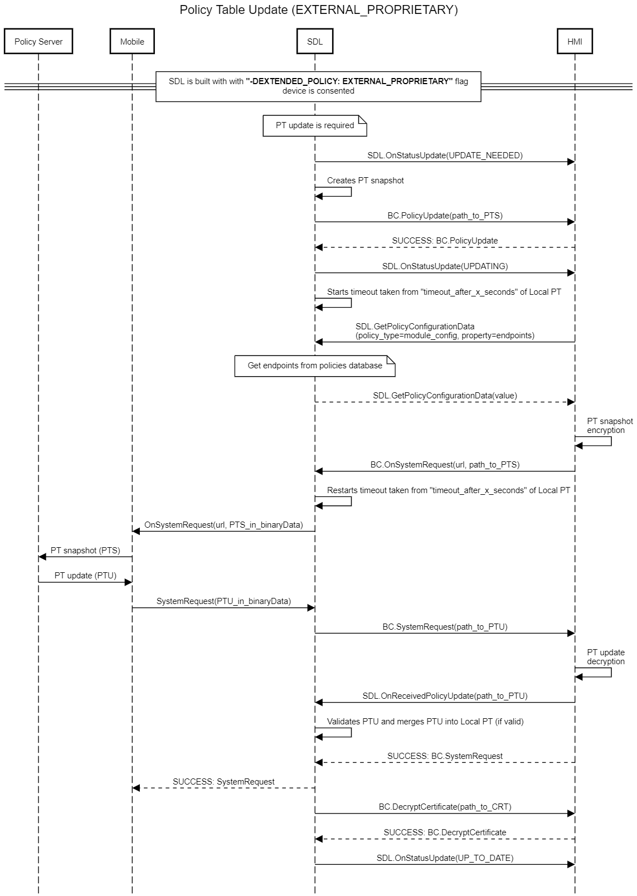
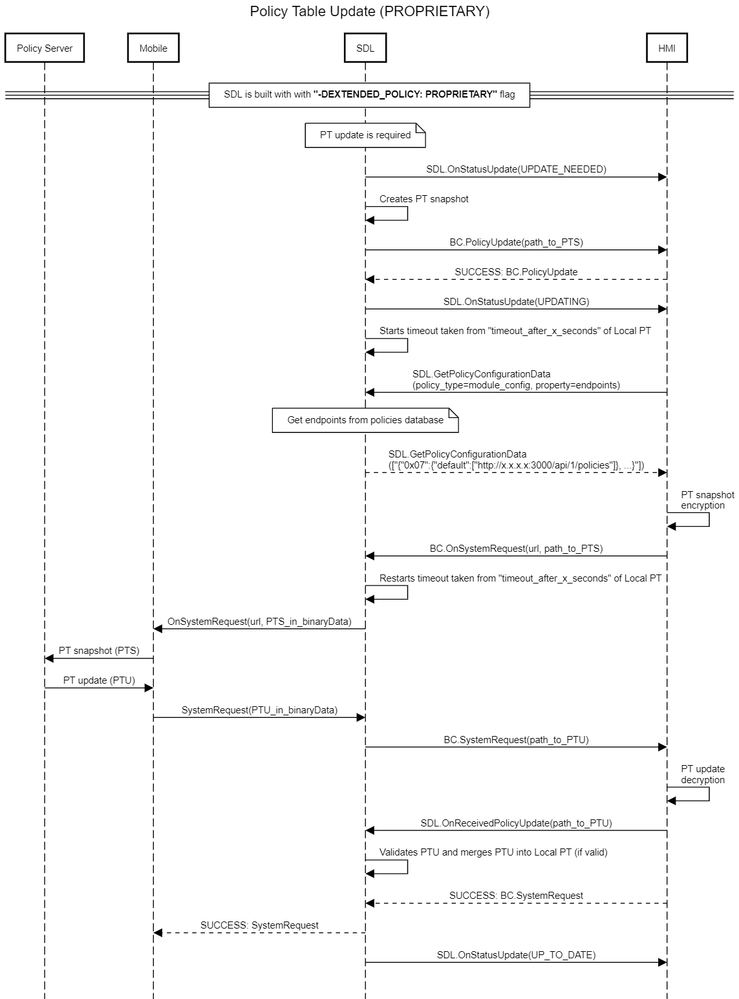

## OnReceivedPolicyUpdate

Type
: Notification

Sender
: HMI

Purpose
: Trigger SDL to merge the Updated Policy Table to the Local Policy Table

### Notification

!!! MUST   
  - Send _SDL.OnReceivedPolicyUpdate_ notification to SDL after HMI finalized processing the updated Policy Table delivered via _BC.SystemRequest_ (for example, after decrypting it _in case_ and by the scheme required by Policies Server).
  - Decrypt the PTU file received via SystemRequest.
  - Notify SDL on successful decryption and provide the path to decrypted PTU file.
!!!

!!! NOTE
1. _SDL.OnReceivedPolicyUpdate_ dependencies:  
    - SDL expects _SDL.OnReceivedPolicyUpdate_ _only in case_ it's built with `"-DEXTENDED_POLICY=PROPRIETARY" flag or without this flag` and `-DEXTENDED_POLICY=EXTERNAL_PROPRIETARY` flag. _Otherwise_ SDL handles the entire PTU flow by itself.
    - SDL will not use Updated PT until notified by HMI.   
   
2. After getting _OnReceivedPolicyUpdate (policyFile)_ from HMI, _SDL must_ stop timeout started by _OnSystemRequest_ and validate the Policy Table Update (policyFile) of optional, required, or omitted:   
    - validation must reject Policy Table updates if it include fields with a status of ‘omitted.’
    - validation must reject Policy Table update if it does not include fields with a status of ‘required’.   
3. In case section with required status "optional/omitted" is omitted in Updated PT, and field of this section is marked as required, the validation of the mentioned field is not "required" (i.e. policy table must be considered as valid).
!!!

#### Parameters

|Name|Type|Mandatory|Additional|
|:---|:---|:--------|:---------|
|policyfile|String|true|minlength: 1<br>maxlength: 255|

### Sequence Diagrams

|||
SDL.OnReceivedPolicyUpdate in "External Proprietary" Policy Table Update Flow

|||

|||
SDL.OnReceivedPolicyUpdate in "Proprietary" Policy Table Update Flow

|||

### JSON Message Examples

#### Example Notification

```json
{
	"id" : 176,
	"jsonrpc" : "2.0",
	"method" : "SDL.OnReceivedPolicyUpdate",
	"params" :
	{
		"policyfile" : "/fs/sharedFolder/ptu.json"
	}
}
```
