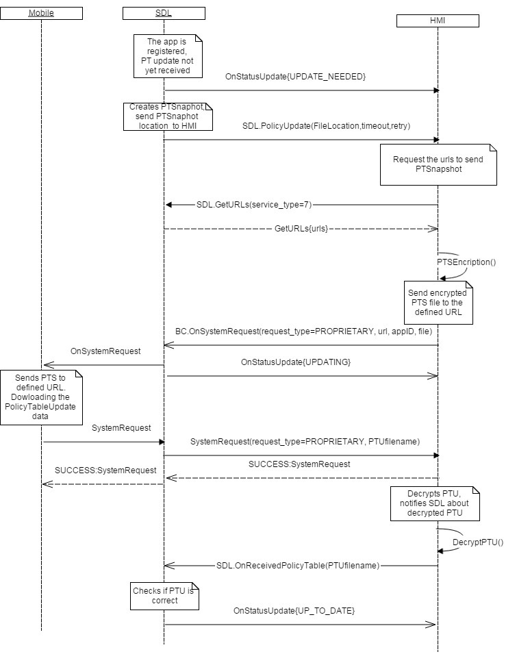

## OnStatusUpdate

Type
: Notification

Sender
: SDL

Purpose
: Inform the HMI about the status of a policy table update.

### Notification

#### Parameters

|Name|Type|Mandatory|Additional|
|:---|:---|:--------|:---------|
|status|[Common.UpdateResult](../../common/enums/index.md#updateresult)|true||

### Sequence Diagrams
|||
OnStatusUpdate

|||

#### JSON Example Notification
```json
{
  "jsonrpc" : "2.0",
  "method" : "SDL.OnStatusUpdate",
  "params" :  
  {
    "status" : "UPDATE_NEEDED"
  }
}
```
